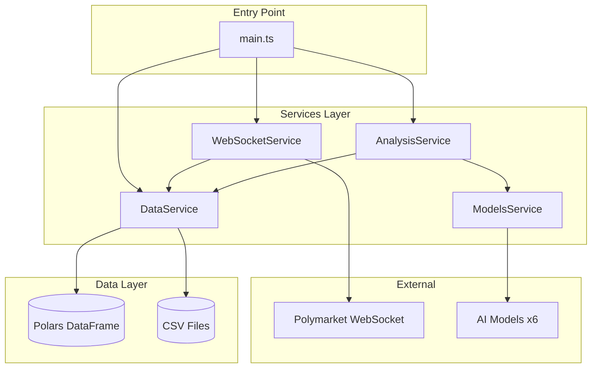

# Refactor Polymarket Agent to Effect.ts with Bun

## Overview

Refactor the Python [polymarket_agent.py](https://github.com/moondevonyt/moon-dev-ai-agents/blob/main/src/agents/polymarket_agent.py) into a TypeScript application using Effect.ts, Bun runtime, and nodejs-polars for data processing. The application monitors Polymarket trades via WebSocket, filters significant trades, and uses multi-model AI swarm analysis to identify consensus trading opportunities.

## Problem Statement

The existing TypeScript implementation at `/Users/kevin/code/src/github/kevmok/lofn` has:
- **Critical bugs** preventing compilation/execution
- **Incorrect API usage** for Effect.ts and nodejs-polars
- **Anti-patterns** (Effect.runPromise inside WebSocket callbacks)
- **Missing functionality** compared to Python original (status reporting, graceful shutdown, proper error handling)
- **Incomplete data persistence** (race conditions, no atomic writes)

## Current Architecture

```
src/
├── config.ts       # Configuration constants (OK)
├── types.ts        # Effect Schema types (OK)
├── models.ts       # AI model layers (HAS BUGS)
├── data.ts         # DataService with Polars (HAS BUGS)
├── prompt.ts       # AI prompts (OK)
├── analysis.ts     # Analysis task (HAS BUGS)
├── main.ts         # Entry point (HAS BUGS)
└── websocket.ts    # WebSocket connection (HAS ANTI-PATTERNS)
```

## Proposed Solution

Fix all critical bugs, implement proper Effect.ts patterns, add missing functionality, and ensure robust error handling.

### Architecture Diagram



## Technical Approach

### Phase 1: Fix Critical Compilation Bugs

#### 1.1 Fix models.ts Import Case

**File**: `src/models.ts:31`

```typescript
// BEFORE (incorrect)
const DeepSeekClient = OpenAIClient.make({...});

// AFTER (correct)
const DeepSeekClient = OpenAiClient.make({...});
```

**Also line 40**:
```typescript
// BEFORE
const XAIClient = OpenAIClient.make({...});

// AFTER
const XAIClient = OpenAiClient.make({...});
```

#### 1.2 Fix analysis.ts Import Path

**File**: `src/analysis.ts:4`

```typescript
// BEFORE (wrong file name)
import { MARKET_ANALYSIS_SYSTEM_PROMPT, CONSENSUS_AI_PROMPT } from "./prompts";

// AFTER (correct file name)
import { MARKET_ANALYSIS_SYSTEM_PROMPT, CONSENSUS_AI_PROMPT } from "./prompt";
```

#### 1.3 Add Missing Imports to analysis.ts

**File**: `src/analysis.ts` (top of file)

```typescript
import { Effect, Ref, Console, Duration, Schema } from "effect";
import { CONFIG } from "./config";
import { DataService } from "./data";
import { MARKET_ANALYSIS_SYSTEM_PROMPT, CONSENSUS_AI_PROMPT } from "./prompt";
import { OpenAI, Anthropic, Google } from "@effect/ai";
import { IndividualPrediction, ConsensusPick } from "./types";
import pl from "nodejs-polars";
```

#### 1.4 Fix main.ts Missing CONFIG Import

**File**: `src/main.ts:1`

```typescript
import { Effect, Schedule, Layer, Duration } from "effect";
import { CONFIG } from "./config";  // ADD THIS
import { analysisTask } from "./analysis";
// ...rest
```

### Phase 2: Fix Polars API Usage

#### 2.1 Fix data.ts Schema.fields Error

**File**: `src/data.ts:28-29`

```typescript
// BEFORE (incorrect - Schema.fields doesn't exist)
const df = pl.readCSV(`${CONFIG.DATA_FOLDER}/markets.csv`, {
  schema: MarketRow.fields,  // ERROR
});

// AFTER (correct - parse and transform)
const loadData = Effect.gen(function* () {
  yield* Effect.tryPromise(() =>
    fs.mkdir(CONFIG.DATA_FOLDER, { recursive: true })
  );

  const marketsPath = `${CONFIG.DATA_FOLDER}/markets.csv`;
  const exists = yield* Effect.tryPromise(() =>
    fs.access(marketsPath).then(() => true).catch(() => false)
  );

  if (exists) {
    const csvContent = yield* Effect.tryPromise(() =>
      fs.readFile(marketsPath, "utf-8")
    );
    // Let Polars infer schema, we'll validate individual rows
    const df = pl.readCSV(csvContent);
    yield* Ref.set(marketsRef, df);
  }
});
```

#### 2.2 Fix websocket.ts DataFrame Operations

**File**: `src/websocket.ts:62-73`

```typescript
// BEFORE (incorrect Polars API)
yield* Ref.update(marketsRef, (df) =>
  df
    .upsert(pl.DataFrame([newRow]))  // .upsert() doesn't exist
    .withColumn(...)
    .unique(["market_id"]),
);

// AFTER (correct Polars API)
yield* Ref.update(marketsRef, (df) => {
  const newDf = pl.DataFrame([newRow]);

  // Concatenate and deduplicate
  const combined = df.height > 0
    ? pl.concat([df, newDf])
    : newDf;

  // Group by market_id and take latest
  return combined
    .groupBy("market_id")
    .agg(
      pl.col("event_slug").last(),
      pl.col("title").last(),
      pl.col("outcome").last(),
      pl.col("price").last(),
      pl.col("size_usd").last(),
      pl.col("timestamp").last(),
      pl.col("first_seen").first(), // Keep original first_seen
      pl.col("last_trade_timestamp").max(),
    );
});
```

### Phase 3: Fix WebSocket Anti-Pattern

**File**: `src/websocket.ts`

Replace `Effect.runPromise` inside callback with Effect Queue pattern:

```typescript
// websocket.ts
import { Effect, Ref, Queue, Fiber, Schedule, Duration } from "effect";
import pl from "nodejs-polars";
import { CONFIG, IGNORE_CRYPTO_KEYWORDS, IGNORE_SPORTS_KEYWORDS } from "./config";
import { DataService } from "./data";

// Define trade message schema
interface TradeMessage {
  type: string;
  payload: {
    market: { id: string; slug: string; question: string };
    volume: string;
    price: string;
    outcome: string;
  };
}

export const websocketEffect = Effect.gen(function* () {
  const { marketsRef } = yield* DataService;

  // Create a queue for incoming messages
  const messageQueue = yield* Queue.unbounded<TradeMessage>();

  // Message processor fiber
  const processorFiber = yield* Effect.fork(
    Effect.forever(
      Effect.gen(function* () {
        const msg = yield* Queue.take(messageQueue);
        yield* processTradeMessage(msg, marketsRef);
      })
    )
  );

  // WebSocket connection with reconnect logic
  yield* Effect.async<void, never>((resume) => {
    const connect = () => {
      const ws = new WebSocket(CONFIG.WEBSOCKET_URL);

      ws.addEventListener("open", () => {
        ws.send(JSON.stringify({
          method: "subscribe",
          subscription: { type: "orders_matched" },
        }));
        console.log("WebSocket connected & subscribed");
      });

      ws.addEventListener("message", (event) => {
        try {
          const data = JSON.parse(event.data as string);
          if (data.type === "orders_matched") {
            // Non-blocking offer to queue
            Effect.runSync(Queue.offer(messageQueue, data));
          }
        } catch (e) {
          console.error("Failed to parse message:", e);
        }
      });

      ws.addEventListener("close", () => {
        console.log("WebSocket closed, reconnecting in 3s...");
        setTimeout(connect, 3000);
      });

      ws.addEventListener("error", (e) => {
        console.error("WebSocket error:", e);
      });
    };

    connect();
    // Never resume - runs forever with reconnects
  });
});

const processTradeMessage = (
  data: TradeMessage,
  marketsRef: Ref.Ref<pl.DataFrame>
) => Effect.gen(function* () {
  const t = data.payload;
  const sizeUsd = Number(t.volume) * Number(t.price);

  // Filter by size
  if (sizeUsd < CONFIG.MIN_TRADE_SIZE_USD) return;

  // Filter by price
  const price = Number(t.price);
  if (price <= CONFIG.IGNORE_PRICE_LOW || price >= CONFIG.IGNORE_PRICE_HIGH) return;

  // Filter by keywords
  const titleLower = t.market.question.toLowerCase();
  const keywords = [...IGNORE_CRYPTO_KEYWORDS, ...IGNORE_SPORTS_KEYWORDS];
  if (keywords.some((k) => titleLower.includes(k))) return;

  // Build row and update DataFrame
  const newRow = {
    market_id: t.market.id,
    event_slug: t.market.slug,
    title: t.market.question,
    outcome: t.outcome === "yes" ? "YES" : "NO",
    price,
    size_usd: sizeUsd,
    timestamp: new Date(),
    first_seen: new Date(),
    last_trade_timestamp: new Date(),
    analyzed: false,
  };

  yield* Ref.update(marketsRef, (df) => {
    const newDf = pl.DataFrame([newRow]);
    const combined = df.height > 0 ? pl.concat([df, newDf]) : newDf;

    return combined
      .groupBy("market_id")
      .agg(
        pl.col("event_slug").last(),
        pl.col("title").last(),
        pl.col("outcome").last(),
        pl.col("price").last(),
        pl.col("size_usd").last(),
        pl.col("timestamp").last(),
        pl.col("first_seen").first(),
        pl.col("last_trade_timestamp").max(),
        pl.col("analyzed").last(),
      );
  });

  console.log(`Trade: ${newRow.title.slice(0, 50)}... | $${sizeUsd.toFixed(0)}`);
});
```

### Phase 4: Add Status Reporting Service

**New File**: `src/status.ts`

```typescript
import { Effect, Ref, Schedule, Duration, Console } from "effect";
import { DataService } from "./data";

export const statusReportingEffect = Effect.gen(function* () {
  const { marketsRef, predictionsRef, consensusRef } = yield* DataService;

  yield* Effect.forever(
    Effect.gen(function* () {
      const markets = yield* Ref.get(marketsRef);
      const predictions = yield* Ref.get(predictionsRef);
      const consensus = yield* Ref.get(consensusRef);

      const unanalyzed = markets.filter(pl.col("analyzed").eq(false)).height;

      console.log("\n--- STATUS REPORT ---");
      console.log(`Markets tracked: ${markets.height}`);
      console.log(`Unanalyzed: ${unanalyzed}`);
      console.log(`Predictions: ${predictions.height}`);
      console.log(`Consensus picks: ${consensus.height}`);
      console.log("-------------------\n");

      yield* Effect.sleep(Duration.seconds(30));
    })
  );
});
```

### Phase 5: Add Graceful Shutdown

**File**: `src/main.ts` (updated)

```typescript
import { Effect, Schedule, Layer, Duration, Fiber, Ref } from "effect";
import { CONFIG } from "./config";
import { analysisTask } from "./analysis";
import { websocketEffect } from "./websocket";
import { statusReportingEffect } from "./status";
import { ModelsLayer } from "./models";
import { DataLayer, DataService } from "./data";

const program = Effect.gen(function* () {
  const data = yield* DataService;

  // Load existing data
  yield* data.loadData;

  // Fork background tasks
  const wsFiber = yield* websocketEffect.pipe(Effect.fork);
  const statusFiber = yield* statusReportingEffect.pipe(Effect.fork);
  const analysisFiber = yield* analysisTask.pipe(
    Effect.repeat(
      Schedule.spaced(Duration.seconds(CONFIG.ANALYSIS_CHECK_INTERVAL_SECONDS))
    ),
    Effect.fork,
  );

  // Graceful shutdown handler
  yield* Effect.async<void, never>((resume) => {
    const shutdown = async () => {
      console.log("\nShutting down gracefully...");

      // Save data before exit
      Effect.runPromise(data.saveAll)
        .then(() => {
          console.log("Data saved. Goodbye!");
          process.exit(0);
        })
        .catch((e) => {
          console.error("Failed to save data:", e);
          process.exit(1);
        });
    };

    process.on("SIGINT", shutdown);
    process.on("SIGTERM", shutdown);

    // Keep alive
  });

  yield* Effect.never;
});

const AppLayer = Layer.mergeAll(ModelsLayer, DataLayer);

program.pipe(
  Effect.provide(AppLayer),
  Effect.catchAllDefect((defect) => {
    console.error("Unhandled defect:", defect);
    return Effect.die(defect);
  }),
  Effect.runPromise
).catch(console.error);
```

### Phase 6: Fix Analysis Service

**File**: `src/analysis.ts` (complete rewrite)

```typescript
import { Effect, Ref, Duration, Schema, Console } from "effect";
import { CONFIG } from "./config";
import { DataService } from "./data";
import { MARKET_ANALYSIS_SYSTEM_PROMPT, CONSENSUS_AI_PROMPT } from "./prompt";
import { Anthropic, OpenAI, Google } from "@effect/ai";
import { IndividualPrediction, ConsensusPick } from "./types";
import pl from "nodejs-polars";
import { randomUUID } from "crypto";

export const analysisTask = Effect.gen(function* () {
  const data = yield* DataService;
  const { marketsRef, predictionsRef, consensusRef } = data;

  const markets = yield* Ref.get(marketsRef);

  // Get unanalyzed markets sorted by recent activity
  const unanalyzed = markets
    .filter(pl.col("analyzed").eq(false))
    .sort("last_trade_timestamp", true)
    .head(CONFIG.MARKETS_TO_ANALYZE);

  if (unanalyzed.height < CONFIG.NEW_MARKETS_FOR_ANALYSIS) {
    console.log(`Waiting for markets (${unanalyzed.height}/${CONFIG.NEW_MARKETS_FOR_ANALYSIS})`);
    return;
  }

  console.log(`\nAnalyzing ${unanalyzed.height} markets...`);

  // Build prompt
  const marketLines = unanalyzed.rows()
    .map((row, i) => {
      const r = row.toObject() as Record<string, unknown>;
      const link = `https://polymarket.com/event/${r.event_slug}`;
      return `${i + 1}. ${r.title} [Link](${link})`;
    })
    .join("\n");

  const userPrompt = `Analyze these markets:\n${marketLines}\n\nRespond with JSON array: [{"decision": "YES|NO|NO_TRADE", "reasoning": "..."}]`;

  if (CONFIG.USE_SWARM_MODE) {
    // Get all available models
    const anthropic = yield* Anthropic.LanguageModel;
    const openai = yield* OpenAI.LanguageModel;
    const google = yield* Google.LanguageModel;

    const models = [
      { name: "Claude", model: anthropic },
      { name: "GPT-4o", model: openai },
      { name: "Gemini", model: google },
    ];

    // Query all models in parallel
    const responses = yield* Effect.all(
      models.map(({ name, model }) =>
        model.complete({
          system: MARKET_ANALYSIS_SYSTEM_PROMPT,
          messages: [{ role: "user", content: userPrompt }],
        }).pipe(
          Effect.timeout(Duration.seconds(120)),
          Effect.map((r) => ({ name, response: r.content })),
          Effect.catchAll(() => Effect.succeed({ name, response: null })),
        )
      ),
      { concurrency: "unbounded" }
    );

    const valid = responses.filter((r) => r.response !== null);
    console.log(`Received ${valid.length}/${models.length} responses`);

    if (valid.length === 0) {
      console.log("No valid responses, skipping consensus");
      return;
    }

    // Build consensus prompt
    const consensusInput = `${CONSENSUS_AI_PROMPT}

Markets analyzed:
${marketLines}

Model responses:
${valid.map((v) => `${v.name}: ${v.response}`).join("\n\n")}

Return JSON array with top ${CONFIG.TOP_MARKETS_COUNT} consensus picks.`;

    const consensusResult = yield* anthropic.complete({
      messages: [{ role: "user", content: consensusInput }],
    }).pipe(
      Effect.timeout(Duration.seconds(120)),
      Effect.catchAll(() => Effect.succeed({ content: "[]" })),
    );

    console.log("\nTOP CONSENSUS PICKS:");
    console.log(consensusResult.content);

    // Mark markets as analyzed
    const analyzedIds = unanalyzed.getColumn("market_id").toArray();
    yield* Ref.update(marketsRef, (df) =>
      df.withColumn(
        pl.when(pl.col("market_id").isIn(analyzedIds))
          .then(pl.lit(true))
          .otherwise(pl.col("analyzed"))
          .alias("analyzed")
      )
    );
  }

  // Save all data
  yield* data.saveAll;
  console.log("Analysis complete, data saved.");
});
```

### Phase 7: Add Atomic File Writes

**File**: `src/data.ts` (saveAll method update)

```typescript
const saveAll = Effect.gen(function* () {
  const [markets, predictions, consensus] = yield* Effect.all([
    Ref.get(marketsRef),
    Ref.get(predictionsRef),
    Ref.get(consensusRef),
  ]);

  // Atomic write pattern: write to temp, then rename
  const writeAtomic = (path: string, content: string) =>
    Effect.gen(function* () {
      const tempPath = `${path}.tmp`;
      yield* Effect.tryPromise(() => Bun.write(tempPath, content));
      yield* Effect.tryPromise(() =>
        fs.rename(tempPath, path)
      );
    });

  yield* Effect.all([
    writeAtomic(`${CONFIG.DATA_FOLDER}/markets.csv`, markets.writeCSV()),
    writeAtomic(`${CONFIG.DATA_FOLDER}/predictions.csv`, predictions.writeCSV()),
    writeAtomic(`${CONFIG.DATA_FOLDER}/consensus_picks.csv`, consensus.writeCSV()),
  ]);
});
```

### Phase 8: Environment Variable Validation

**New File**: `src/env.ts`

```typescript
import { Effect, Config, Schema } from "effect";
import { env } from "bun";

export class EnvConfig extends Schema.Class<EnvConfig>("EnvConfig")({
  OPENAI_KEY: Schema.optionalWith(Schema.String, { default: () => "" }),
  ANTHROPIC_KEY: Schema.optionalWith(Schema.String, { default: () => "" }),
  GEMINI_KEY: Schema.optionalWith(Schema.String, { default: () => "" }),
  GROQ_API_KEY: Schema.optionalWith(Schema.String, { default: () => "" }),
  DEEPSEEK_KEY: Schema.optionalWith(Schema.String, { default: () => "" }),
  XAI_API_KEY: Schema.optionalWith(Schema.String, { default: () => "" }),
}) {}

export const validateEnv = Effect.gen(function* () {
  const keys = {
    OPENAI_KEY: env.OPENAI_KEY,
    ANTHROPIC_KEY: env.ANTHROPIC_KEY,
    GEMINI_KEY: env.GEMINI_KEY,
    GROQ_API_KEY: env.GROQ_API_KEY,
    DEEPSEEK_KEY: env.DEEPSEEK_KEY,
    XAI_API_KEY: env.XAI_API_KEY,
  };

  const configured = Object.entries(keys)
    .filter(([_, v]) => v && v.length > 0)
    .map(([k]) => k);

  if (configured.length === 0) {
    yield* Effect.fail(new Error("No AI API keys configured. Set at least one of: OPENAI_KEY, ANTHROPIC_KEY, GEMINI_KEY"));
  }

  console.log(`Configured AI providers: ${configured.join(", ")}`);
  return keys;
});
```

## Implementation Phases

### Phase 1: Foundation (Critical Bug Fixes)
- [ ] Fix models.ts import case mismatch at line 31 and 40
- [ ] Fix analysis.ts import path from `./prompts` to `./prompt`
- [ ] Add missing imports to analysis.ts (Duration, Schema, IndividualPrediction)
- [ ] Add CONFIG import to main.ts

### Phase 2: Polars API Corrections
- [ ] Fix data.ts:28-29 Schema.fields usage (use correct Polars API)
- [ ] Fix websocket.ts:62-73 DataFrame operations (use groupBy instead of upsert)
- [ ] Verify nodejs-polars 0.23.4 API compatibility

### Phase 3: Effect Pattern Fixes
- [ ] Replace Effect.runPromise in WebSocket callback with Queue pattern
- [ ] Add proper error boundaries with Effect.catchAll
- [ ] Implement Effect.async for WebSocket connection

### Phase 4: Missing Features
- [ ] Add status reporting service (30-second interval)
- [ ] Implement graceful shutdown (SIGINT/SIGTERM handlers)
- [ ] Add atomic file writes (temp + rename pattern)
- [ ] Add environment variable validation on startup

### Phase 5: Analysis Improvements
- [ ] Fix "analyzed" flag tracking
- [ ] Implement consensus JSON parsing with Schema
- [ ] Preserve first_seen timestamp on updates
- [ ] Generate proper run_id for ConsensusPick

### Phase 6: Testing & Validation
- [ ] Test fresh start (no CSV files)
- [ ] Test WebSocket reconnection
- [ ] Test graceful shutdown data persistence
- [ ] Test with various AI key configurations

## Success Metrics

- [ ] Application compiles without TypeScript errors
- [ ] WebSocket connects and receives trades
- [ ] Trades are properly filtered and stored
- [ ] Analysis runs every 300 seconds
- [ ] AI models respond successfully
- [ ] Consensus is logged and saved
- [ ] Data persists across restarts
- [ ] Graceful shutdown saves all data

## Dependencies & Prerequisites

**Required Packages** (already in package.json):
- effect@^3.19.12
- @effect/ai@^0.32.1
- @effect/ai-anthropic@^0.22.0
- @effect/ai-google@^0.11.1
- @effect/ai-openai@^0.36.0
- nodejs-polars@^0.23.4

**Environment Variables** (at least one required):
- ANTHROPIC_KEY (recommended)
- OPENAI_KEY
- GEMINI_KEY
- GROQ_API_KEY
- DEEPSEEK_KEY
- XAI_API_KEY

## Risk Analysis & Mitigation

| Risk | Mitigation |
|------|------------|
| Polymarket WebSocket API changes | Add payload validation with Schema |
| AI API rate limits | Implement exponential backoff |
| Large DataFrames (1000+ markets) | Add pagination, periodic cleanup |
| Network failures during save | Atomic writes with temp files |
| Memory leaks from Queue | Add bounded queue with backpressure |

## References

### Internal References
- `/Users/kevin/code/src/github/kevmok/lofn/src/config.ts:1-38` - Configuration
- `/Users/kevin/code/src/github/kevmok/lofn/src/types.ts:1-38` - Schema types
- `/Users/kevin/code/src/github/kevmok/lofn/agent-rules/effect.md` - Effect docs location

### External References
- [Effect.ts Documentation](https://effect.website/docs)
- [Effect/AI Documentation](https://effect.website/docs/ai/introduction/)
- [nodejs-polars Documentation](https://pola-rs.github.io/nodejs-polars)
- [Bun WebSocket API](https://bun.sh/docs/api/websockets)
- [Original Python Agent](https://github.com/moondevonyt/moon-dev-ai-agents/blob/main/src/agents/polymarket_agent.py)

## Notes

- All code follows Bun-first conventions per CLAUDE.md
- Effect.ts patterns follow services/layers architecture
- No dotenv needed (Bun auto-loads .env)
- Use `bun run src/main.ts` to start
