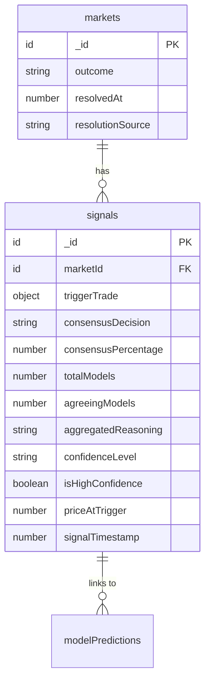

# Plan 1: Backend Schema - Signals Table & Market Outcome Tracking

## Overview

Add two foundational backend components that enable whale trade signal tracking and performance measurement:

1. **Signals table** - Store whale trade-triggered AI consensus events
2. **Market outcome tracking** - Extend markets table to track resolution outcomes

## Problem Statement / Motivation

Currently, the system runs AI analysis on a time-based schedule (every 30 minutes) or on-demand. There's no mechanism to:

- Capture signals triggered by specific whale trades
- Track the triggering trade details alongside AI consensus
- Measure AI prediction accuracy against resolved market outcomes
- Calculate win rates and ROI for backtesting/performance display

## Proposed Solution

### Phase 1: Signals Table Addition

Add a new `signals` table to store whale trade-triggered AI consensus events.



### Phase 2: Market Outcome Tracking

Extend the `markets` table with resolution fields to enable performance tracking.

## Technical Approach

### Files to Modify

| File                                 | Changes                                                   |
| ------------------------------------ | --------------------------------------------------------- |
| `packages/backend/convex/schema.ts`  | Add `signals` table, extend `markets` with outcome fields |
| `packages/backend/convex/signals.ts` | New file: CRUD operations for signals                     |

### Schema Changes

```typescript
// packages/backend/convex/schema.ts

// Add to markets table definition
markets: defineTable({
  // ... existing fields ...

  // NEW: Outcome tracking fields
  outcome: v.optional(v.union(v.literal("YES"), v.literal("NO"), v.literal("INVALID"), v.null())),
  resolvedAt: v.optional(v.number()),
  resolutionSource: v.optional(v.string()),
})
  // ... existing indexes ...
  .index("by_resolved", ["outcome", "resolvedAt"]),

// NEW: Signals table
signals: defineTable({
  marketId: v.id("markets"),

  // Trigger trade details (single trade or aggregated array)
  triggerTrade: v.union(
    // Single trade
    v.object({
      size: v.number(),  // Already in USD from Polymarket
      price: v.number(),
      side: v.union(v.literal("YES"), v.literal("NO")),
      taker: v.optional(v.string()),
      timestamp: v.number(),
    }),
    // Multiple trades aggregated within dedup window
    v.array(v.object({
      size: v.number(),
      price: v.number(),
      side: v.union(v.literal("YES"), v.literal("NO")),
      taker: v.optional(v.string()),
      timestamp: v.number(),
    }))
  ),

  // AI consensus results (same structure as insights)
  consensusDecision: v.union(
    v.literal("YES"),
    v.literal("NO"),
    v.literal("NO_TRADE"),
  ),
  consensusPercentage: v.number(),
  totalModels: v.number(),
  agreeingModels: v.number(),
  aggregatedReasoning: v.string(),
  confidenceLevel: v.union(
    v.literal("high"),
    v.literal("medium"),
    v.literal("low"),
  ),
  isHighConfidence: v.boolean(),
  priceAtTrigger: v.number(),

  // When the signal was stored
  signalTimestamp: v.number(),
})
  .index("by_market", ["marketId"])
  .index("by_timestamp", ["signalTimestamp"])
  .index("by_decision", ["consensusDecision", "signalTimestamp"])
  .index("by_high_confidence", ["isHighConfidence", "signalTimestamp"])
  .index("by_market_time", ["marketId", "signalTimestamp"]),
```

### Signals Module

```typescript
// packages/backend/convex/signals.ts

import { v } from 'convex/values';
import { mutation, query, internalMutation } from './_generated/server';
import type { Doc } from './_generated/dataModel';

// ============ MUTATIONS ============

export const createSignal = internalMutation({
  args: {
    marketId: v.id('markets'),
    triggerTrade: v.object({
      size: v.number(),
      price: v.number(),
      side: v.union(v.literal('YES'), v.literal('NO')),
      taker: v.optional(v.string()),
      timestamp: v.number(),
    }),
    consensusDecision: v.union(
      v.literal('YES'),
      v.literal('NO'),
      v.literal('NO_TRADE'),
    ),
    consensusPercentage: v.number(),
    totalModels: v.number(),
    agreeingModels: v.number(),
    aggregatedReasoning: v.string(),
    priceAtTrigger: v.number(),
  },
  handler: async (ctx, args) => {
    // Per design decision: 80%+ = high, 60-79% = medium, <60% = low
    const confidenceLevel =
      args.consensusPercentage >= 80
        ? ('high' as const)
        : args.consensusPercentage >= 60
          ? ('medium' as const)
          : ('low' as const);

    return await ctx.db.insert('signals', {
      ...args,
      confidenceLevel,
      isHighConfidence: args.consensusPercentage >= 80,  // Aligned with "high" level
      signalTimestamp: Date.now(),
    });
  },
});

// ============ QUERIES ============

export const getLatestSignals = query({
  args: {
    limit: v.optional(v.number()),
    onlyHighConfidence: v.optional(v.boolean()),
  },
  handler: async (ctx, args) => {
    const limit = args.limit ?? 20;

    if (args.onlyHighConfidence) {
      const signals = await ctx.db
        .query('signals')
        .withIndex('by_high_confidence', (q) => q.eq('isHighConfidence', true))
        .order('desc')
        .take(limit);

      return enrichSignalsWithMarkets(ctx, signals);
    }

    const signals = await ctx.db
      .query('signals')
      .withIndex('by_timestamp')
      .order('desc')
      .take(limit);

    return enrichSignalsWithMarkets(ctx, signals);
  },
});

export const getSignalsByMarket = query({
  args: {
    marketId: v.id('markets'),
    limit: v.optional(v.number()),
  },
  handler: async (ctx, args) => {
    return await ctx.db
      .query('signals')
      .withIndex('by_market', (q) => q.eq('marketId', args.marketId))
      .order('desc')
      .take(args.limit ?? 50);
  },
});

export const getSignalsWithPagination = query({
  args: {
    cursor: v.optional(v.string()),
    limit: v.optional(v.number()),
    onlyHighConfidence: v.optional(v.boolean()),
    decision: v.optional(v.union(
      v.literal('YES'),
      v.literal('NO'),
      v.literal('NO_TRADE'),
    )),
  },
  handler: async (ctx, args) => {
    const limit = args.limit ?? 20;
    // Note: Convex pagination uses cursor-based approach
    // Implementation depends on specific filtering needs

    let query = ctx.db.query('signals').withIndex('by_timestamp').order('desc');

    if (args.onlyHighConfidence) {
      query = ctx.db
        .query('signals')
        .withIndex('by_high_confidence', (q) => q.eq('isHighConfidence', true))
        .order('desc');
    }

    const signals = await query.take(limit + 1);
    const hasMore = signals.length > limit;
    const items = hasMore ? signals.slice(0, -1) : signals;

    return {
      items: await enrichSignalsWithMarkets(ctx, items),
      hasMore,
      nextCursor: hasMore ? items[items.length - 1]._id : undefined,
    };
  },
});

// ============ DEDUPLICATION ============

export const getRecentSignalForMarket = query({
  args: {
    marketId: v.id('markets'),
    withinMs: v.number(), // e.g., 60000 for 1 minute
  },
  handler: async (ctx, args) => {
    const cutoff = Date.now() - args.withinMs;

    return await ctx.db
      .query('signals')
      .withIndex('by_market_time', (q) =>
        q.eq('marketId', args.marketId).gte('signalTimestamp', cutoff)
      )
      .order('desc')
      .first();
  },
});

// ============ HELPERS ============

async function enrichSignalsWithMarkets(
  ctx: any,
  signals: Doc<'signals'>[],
): Promise<(Doc<'signals'> & { market: Doc<'markets'> | null })[]> {
  return Promise.all(
    signals.map(async (signal) => {
      const market = await ctx.db.get(signal.marketId);
      return { ...signal, market };
    }),
  );
}
```

### Markets Table Extension

```typescript
// packages/backend/convex/markets.ts (add to existing file)

export const updateMarketOutcome = internalMutation({
  args: {
    marketId: v.id('markets'),
    outcome: v.union(v.literal('YES'), v.literal('NO'), v.null()),
    resolutionSource: v.optional(v.string()),
  },
  handler: async (ctx, args) => {
    await ctx.db.patch(args.marketId, {
      outcome: args.outcome,
      resolvedAt: Date.now(),
      resolutionSource: args.resolutionSource,
      isActive: false,
      updatedAt: Date.now(),
    });
  },
});

export const getResolvedMarkets = query({
  args: {
    limit: v.optional(v.number()),
    since: v.optional(v.number()),
  },
  handler: async (ctx, args) => {
    const limit = args.limit ?? 100;

    return await ctx.db
      .query('markets')
      .withIndex('by_resolved')
      .filter((q) =>
        q.and(
          q.neq(q.field('outcome'), undefined),
          args.since ? q.gte(q.field('resolvedAt'), args.since) : q.eq(1, 1)
        )
      )
      .order('desc')
      .take(limit);
  },
});

export const getUnresolvedMarkets = query({
  args: {
    limit: v.optional(v.number()),
  },
  handler: async (ctx, args) => {
    return await ctx.db
      .query('markets')
      .withIndex('by_active', (q) => q.eq('isActive', true))
      .filter((q) => q.eq(q.field('outcome'), undefined))
      .take(args.limit ?? 100);
  },
});
```

## Acceptance Criteria

### Functional Requirements

- [ ] `signals` table created with all specified fields
- [ ] `signals` table has all 5 indexes defined
- [ ] `markets` table extended with `outcome`, `resolvedAt`, `resolutionSource`
- [ ] `markets` table has `by_resolved` index
- [ ] `createSignal` mutation properly calculates confidence level
- [ ] `getLatestSignals` returns signals with enriched market data
- [ ] `getRecentSignalForMarket` supports deduplication within time window
- [ ] `updateMarketOutcome` properly updates market resolution fields

### Non-Functional Requirements

- [ ] Schema changes are backward compatible (all new fields optional)
- [ ] Indexes support the primary query patterns efficiently
- [ ] No breaking changes to existing `insights` or `markets` queries

### Quality Gates

- [ ] `bun run typecheck` passes in packages/backend
- [ ] Schema compiles without errors
- [ ] Existing tests continue to pass

## Implementation Steps

1. **Update schema.ts** - Add signals table definition and markets extensions
2. **Create signals.ts** - Implement all query/mutation functions
3. **Update markets.ts** - Add outcome-related functions
4. **Run typecheck** - Verify all types resolve correctly
5. **Deploy schema** - `npx convex dev` to push schema changes

## Dependencies

- None (foundational schema work)

## Risk Analysis

| Risk                                  | Likelihood | Impact | Mitigation                                    |
| ------------------------------------- | ---------- | ------ | --------------------------------------------- |
| Schema migration breaks existing data | Low        | High   | All new fields are optional                   |
| Index overhead on high-volume writes  | Medium     | Medium | Signals table designed for append-only writes |
| Foreign key consistency               | Low        | Medium | Convex handles this via v.id() validators     |

## References

### Internal References

- Existing schema: `packages/backend/convex/schema.ts`
- Insights pattern: `packages/backend/convex/insights.ts`
- Analysis structure: `packages/backend/convex/analysis.ts`

### External References

- Convex schema docs: https://docs.convex.dev/database/schemas
- Convex indexes: https://docs.convex.dev/database/indexes
