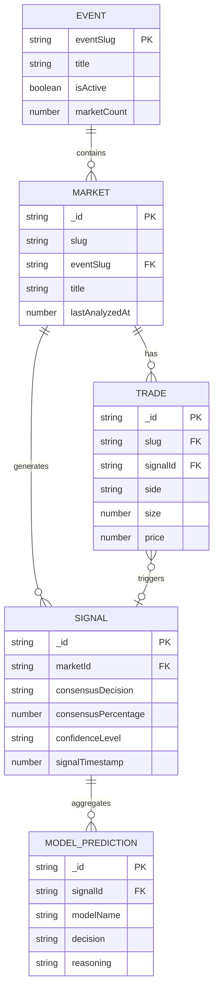

# Dashboard Table & Routing Refactor

## Overview

Transform the dashboard from card-based views to table-based views with URL-routed drawers for deep linking. This is an AI-first SaaS application, so the focus shifts from "live trades" to "AI signals" as the primary data display.

**Category:** Enhancement
**Complexity:** High
**Affected Areas:** Trades page, Events page, Routing system

## Problem Statement / Motivation

The current dashboard has several UX limitations:

1. **Card-based views** are harder to scan and compare at scale
2. **State-based modals** prevent deep linking and sharing
3. **Trades focus** doesn't align with AI-first product positioning
4. **Events page** shows only collected markets, not full Polymarket inventory
5. **Recent trades** in events can't link to their AI signals
6. **No URL state** - filters, sorts, and selections reset on refresh

Users need:
- Scannable, sortable table views for signals and events
- Shareable URLs for specific signal/event details
- Clear visualization of analysis coverage (analyzed vs unanalyzed markets)
- Seamless navigation between related entities (signal → market → event)

## Proposed Solution

### High-Level Architecture

```
/dashboard/trades              → Signals table with filters
/dashboard/trades/$signalId    → Signal detail drawer (route outlet)
/dashboard/events              → Events table with analysis status
/dashboard/events/$eventId     → Event detail drawer (route outlet)
```

### Key Changes

1. **Replace card views with TanStack Table** using existing `DataTable` component
2. **Implement nested routes** with `<Outlet />` for drawer content
3. **Store selection in URL** path params for shareability
4. **Add filter/sort search params** with validation
5. **Enhance events** to show API market counts vs analyzed counts

## Technical Approach

### Phase 1: Routing Infrastructure

Convert from state-based modals to route-based drawers:

**File Structure:**
```
routes/dashboard/
├── trades/
│   ├── route.tsx              # Layout with table + drawer shell
│   └── $signalId.tsx          # Drawer content route
├── events/
│   ├── route.tsx              # Layout with table + drawer shell
│   └── $eventId.tsx           # Drawer content route
```

**Search Param Schema:**
```typescript
// routes/dashboard/trades/route.tsx
const searchSchema = z.object({
  // Filters
  decision: z.enum(['YES', 'NO', 'NO_TRADE', 'all']).default('all'),
  confidence: z.enum(['high', 'medium', 'low', 'all']).default('all'),
  dateFrom: z.string().optional(),
  dateTo: z.string().optional(),

  // Sorting
  sort: z.enum(['timestamp', 'confidence', 'consensusPercentage']).default('timestamp'),
  order: z.enum(['asc', 'desc']).default('desc'),

  // Pagination
  page: z.number().default(1),
  limit: z.number().default(50),
});
```

### Phase 2: Trades Page → Signals Table

**Current:** Two tabs (Live Trades, AI Signals) with card grid
**New:** Single table of AI signals with comprehensive columns

#### Table Columns

| Column | Data Source | Sortable | Notes |
|--------|-------------|----------|-------|
| Timestamp | `signalTimestamp` | Yes | Relative time (e.g., "2h ago") |
| Market | `market.title` | No | Truncated with tooltip |
| Event | `market.eventSlug` | No | Link to event detail |
| Decision | `consensusDecision` | Yes | Badge: YES (green), NO (red), NO_TRADE (gray) |
| Consensus | `consensusPercentage` | Yes | Percentage with confidence icon |
| Confidence | `confidenceLevel` | Yes | high/medium/low badge |
| Price @ Analysis | `priceAtTrigger` | Yes | Format: $0.65 |
| Trigger Size | `triggerTrade.size` | Yes | Whale indicator if >$5k |

#### Signal Detail Drawer (`$signalId.tsx`)

Content structure:
1. **Header**: Market title, decision badge, confidence level
2. **AI Consensus Section**: Vote distribution chart, reasoning summary
3. **Individual Model Predictions**: Expandable cards per model (Claude, GPT-4o, Gemini)
4. **Market Context**: Current price, price change since analysis, outcome if resolved
5. **Trigger Trade**: Original trade that triggered analysis
6. **Related**: Link to event, link to market detail

### Phase 3: Events Page → Events Table

**Current:** Card grid showing tracked events
**New:** Table with analysis coverage and market breakdown

#### Table Columns

| Column | Data Source | Sortable | Notes |
|--------|-------------|----------|-------|
| Event | `title` | No | Image + title |
| Status | `isActive` | Yes | Active/Closed badge |
| Markets | Computed | Yes | "5/12 analyzed" format |
| Signals | `signalCount` | Yes | Total AI signals generated |
| Volume | `totalVolume` | Yes | Formatted (e.g., $1.2M) |
| Last Activity | `lastTradeAt` | Yes | Relative time |

#### Event Detail Drawer (`$eventId.tsx`)

Content structure:
1. **Header**: Event title, image, active status
2. **Stats Row**: Total volume, trade count, signal count
3. **Markets Table**: All markets with analysis status
   - Column: Market title, current price, analyzed (yes/no), signal count
   - Click market → Navigate to `/dashboard/markets/$marketId`
4. **Recent Signals**: Last 5 signals for this event's markets
   - Clickable → Navigate to `/dashboard/trades/$signalId`
5. **Actions**: Add to watchlist, request analysis (if unanalyzed markets)

### Phase 4: Market Count Enhancement

**Problem:** Events currently show only collected market count
**Solution:** Fetch event data from Polymarket API to show total markets

```typescript
// events.ts query enhancement
export const eventsQueries = {
  withMarketCounts: (eventSlug: string) => ({
    queryKey: ['events', eventSlug, 'marketCounts'],
    queryFn: async () => {
      const [dbEvent, apiEvent] = await Promise.all([
        convex.query(api.events.getEventWithMarkets, { eventSlug }),
        convex.action(api.events.fetchBySlug, { eventSlug }),
      ]);
      return {
        ...dbEvent,
        totalMarketsFromAPI: apiEvent?.markets?.length ?? 0,
        analyzedMarkets: dbEvent?.markets?.filter(m => m.lastAnalyzedAt)?.length ?? 0,
      };
    },
  }),
};
```

Display format: `"5/12 analyzed"` where 5 = analyzed in DB, 12 = total from API

## Acceptance Criteria

### Functional Requirements

- [ ] Trades page displays signals in a sortable, filterable table
- [ ] Clicking a signal row opens drawer at `/dashboard/trades/$signalId`
- [ ] Signal drawer shows comprehensive AI analysis with model breakdowns
- [ ] Events page displays events in a sortable table
- [ ] Events show "X/Y analyzed" market counts (Y from Polymarket API)
- [ ] Clicking an event row opens drawer at `/dashboard/events/$eventId`
- [ ] Event drawer shows all markets with analysis status
- [ ] Clicking a market in event drawer navigates appropriately
- [ ] Recent signals in event drawer are clickable and navigate to signal detail
- [ ] URL search params persist filter/sort state across refresh
- [ ] Drawer close navigates to parent route (`/dashboard/trades` or `/dashboard/events`)
- [ ] Deep links to specific signals/events load correctly with drawer open

### Non-Functional Requirements

- [ ] Table renders smoothly with 500+ rows (virtual scrolling if needed)
- [ ] Drawer opens within 200ms (skeleton loading for data)
- [ ] Mobile breakpoint (<768px) shows full-screen drawer instead of side panel
- [ ] Keyboard accessible: Arrow keys navigate rows, Enter opens drawer, Escape closes

### Quality Gates

- [ ] All new routes have loader functions for data prefetching
- [ ] TypeScript strict mode passes with no errors
- [ ] Existing tests pass; new E2E tests for routing
- [ ] Code review approval

## Implementation Files

### New Files

```
apps/web/src/routes/dashboard/trades/
├── route.tsx                    # Signals layout with table + drawer outlet
├── $signalId.tsx                # Signal detail drawer content
└── -components/
    ├── signals-table.tsx        # Table component for signals
    ├── signal-columns.tsx       # Column definitions
    └── signal-detail-content.tsx # Drawer inner content

apps/web/src/routes/dashboard/events/
├── route.tsx                    # Events layout with table + drawer outlet
├── $eventId.tsx                 # Event detail drawer content
└── -components/
    ├── events-table.tsx         # Table component for events
    ├── event-columns.tsx        # Column definitions
    └── event-detail-content.tsx # Drawer inner content
```

### Modified Files

```
apps/web/src/lib/queries/events.ts       # Add API market count fetching
apps/web/src/lib/queries/signals.ts      # Add pagination support
packages/backend/convex/events.ts        # New query for event + API data
packages/backend/convex/signals.ts       # Add paginated list query
```

### Files to Remove/Deprecate

```
apps/web/src/routes/dashboard/trades/index.tsx                    # Replaced by route.tsx
apps/web/src/routes/dashboard/trades/-components/trade-feed.tsx   # Replace with table
apps/web/src/routes/dashboard/trades/-components/signal-card.tsx  # Move to table row
apps/web/src/routes/dashboard/events/index.tsx                    # Replaced by route.tsx
apps/web/src/routes/dashboard/events/-components/tracked-event-card.tsx # Move to table row
```

## MVP Code Structure

### route.tsx (Trades Layout)

```tsx
// apps/web/src/routes/dashboard/trades/route.tsx
import { createFileRoute, Outlet, useMatch, useNavigate } from '@tanstack/react-router';
import { z } from 'zod';
import { Sheet, SheetContent } from '@/components/ui/sheet';
import { SignalsTable } from './-components/signals-table';

const searchSchema = z.object({
  decision: z.enum(['YES', 'NO', 'NO_TRADE', 'all']).default('all').catch('all'),
  confidence: z.enum(['high', 'medium', 'low', 'all']).default('all').catch('all'),
  sort: z.enum(['timestamp', 'confidence', 'consensusPercentage']).default('timestamp').catch('timestamp'),
  order: z.enum(['asc', 'desc']).default('desc').catch('desc'),
  page: z.coerce.number().default(1).catch(1),
});

export const Route = createFileRoute('/dashboard/trades')({
  validateSearch: searchSchema,
  component: TradesLayout,
});

function TradesLayout() {
  const navigate = useNavigate();
  const search = Route.useSearch();

  // Check if child route (drawer) is active
  const childMatch = useMatch({
    from: '/dashboard/trades/$signalId',
    shouldThrow: false,
  });

  const handleDrawerClose = () => {
    navigate({ to: '/dashboard/trades', search });
  };

  return (
    <div className="flex flex-col h-full">
      <div className="flex-1 overflow-hidden">
        <SignalsTable
          filters={search}
          onRowClick={(signal) => navigate({
            to: '/dashboard/trades/$signalId',
            params: { signalId: signal._id },
            search,
          })}
        />
      </div>

      <Sheet open={!!childMatch} onOpenChange={(open) => !open && handleDrawerClose()}>
        <SheetContent className="w-[600px] sm:max-w-[600px] overflow-y-auto">
          <Outlet />
        </SheetContent>
      </Sheet>
    </div>
  );
}
```

### $signalId.tsx (Signal Detail)

```tsx
// apps/web/src/routes/dashboard/trades/$signalId.tsx
import { createFileRoute } from '@tanstack/react-router';
import { useSuspenseQuery } from '@tanstack/react-query';
import { signalsQueries } from '@/lib/queries';
import { SignalDetailContent } from './-components/signal-detail-content';

export const Route = createFileRoute('/dashboard/trades/$signalId')({
  loader: async ({ params, context }) => {
    await context.queryClient.ensureQueryData(
      signalsQueries.withPredictions(params.signalId)
    );
  },
  component: SignalDetail,
});

function SignalDetail() {
  const { signalId } = Route.useParams();
  const { data: signal } = useSuspenseQuery(
    signalsQueries.withPredictions(signalId)
  );

  if (!signal) {
    return <div className="p-4">Signal not found</div>;
  }

  return <SignalDetailContent signal={signal} />;
}
```

### signal-columns.tsx

```tsx
// apps/web/src/routes/dashboard/trades/-components/signal-columns.tsx
import { ColumnDef } from '@tanstack/react-table';
import { Badge } from '@/components/ui/badge';
import { formatDistanceToNow } from 'date-fns';
import type { Signal } from '@/lib/queries/signals';

export const signalColumns: ColumnDef<Signal>[] = [
  {
    accessorKey: 'signalTimestamp',
    header: 'Time',
    cell: ({ getValue }) => formatDistanceToNow(getValue() as number, { addSuffix: true }),
    sortingFn: 'datetime',
  },
  {
    accessorKey: 'market.title',
    header: 'Market',
    cell: ({ getValue }) => (
      <span className="max-w-[200px] truncate block" title={getValue() as string}>
        {getValue() as string}
      </span>
    ),
  },
  {
    accessorKey: 'consensusDecision',
    header: 'Decision',
    cell: ({ getValue }) => {
      const decision = getValue() as 'YES' | 'NO' | 'NO_TRADE';
      const colors = {
        YES: 'bg-emerald-500/10 text-emerald-500',
        NO: 'bg-red-500/10 text-red-500',
        NO_TRADE: 'bg-gray-500/10 text-gray-500',
      };
      return <Badge className={colors[decision]}>{decision}</Badge>;
    },
  },
  {
    accessorKey: 'consensusPercentage',
    header: 'Consensus',
    cell: ({ getValue }) => `${(getValue() as number).toFixed(0)}%`,
    sortingFn: 'alphanumeric',
  },
  {
    accessorKey: 'confidenceLevel',
    header: 'Confidence',
    cell: ({ getValue }) => {
      const level = getValue() as 'high' | 'medium' | 'low';
      const colors = {
        high: 'bg-emerald-500/10 text-emerald-500',
        medium: 'bg-amber-500/10 text-amber-500',
        low: 'bg-gray-500/10 text-gray-500',
      };
      return <Badge className={colors[level]}>{level}</Badge>;
    },
  },
  {
    accessorKey: 'priceAtTrigger',
    header: 'Price @ Signal',
    cell: ({ getValue }) => `$${(getValue() as number).toFixed(2)}`,
  },
];
```

## Data Relationships



## Critical Questions to Resolve

Before implementation, clarify:

1. **Drawer close behavior**: When user closes drawer via deep link, navigate to parent route (recommended) or use `history.back()`?

2. **Cross-entity navigation**: From signal drawer, clicking event link should:
   - A) Navigate to `/dashboard/events/$eventId` (close current, open new)
   - B) Replace drawer content inline

3. **Mobile drawer**: Full-screen modal or bottom sheet on mobile?

4. **Real-time updates**: Auto-update table when new signals arrive, or show "3 new signals" toast?

5. **Market count source**: For "5/12 analyzed" - does the Polymarket API have an endpoint that returns all markets for an event? Need to verify API availability.

## References

### Internal References
- DataTable component: `apps/web/src/routes/dashboard/-components/data-table.tsx`
- Market columns pattern: `apps/web/src/routes/dashboard/-components/market-columns.tsx`
- Sheet component: `apps/web/src/components/ui/sheet.tsx`
- Signals queries: `apps/web/src/lib/queries/signals.ts`
- Events queries: `apps/web/src/lib/queries/events.ts`
- Backend schema: `packages/backend/convex/schema.ts`

### External References
- TanStack Router outlets: https://tanstack.com/router/latest/docs/framework/react/guide/outlets
- TanStack Router search params: https://tanstack.com/router/latest/docs/framework/react/guide/search-params
- TanStack Table sorting: https://tanstack.com/table/v8/docs/guide/sorting
- shadcn/ui Sheet: https://ui.shadcn.com/docs/components/sheet

---

Generated with [Claude Code](https://claude.com/claude-code)
