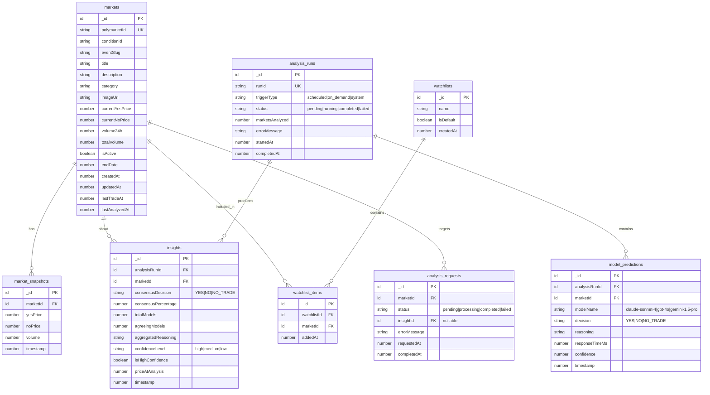

# feat: Lofn SaaS Backend Architecture

## Overview

Transform Lofn from a single-user CLI prediction market analyzer into a SaaS backend. This plan focuses on the **core business logic** in Convex: markets, AI insights, analysis runs, and watchlists.

**Out of Scope (handled separately):** User authentication, subscriptions, and billing.

## Problem Statement

**Current State:**

- Single-user CLI application writing to local CSV files
- In-memory Polars DataFrames with periodic file saves
- AI swarm queries run locally
- No persistent database

**Target State:**

- Convex backend for persistent storage
- Real-time market tracking
- AI analysis with stored predictions and consensus insights
- On-demand and scheduled analysis runs
- Watchlist management for tracking markets

## Technical Approach

### Architecture Overview

```
┌─────────────────────────────────────────────────────────────────────────┐
│                           Frontend (Future)                              │
│                    React + Convex React Hooks                           │
└─────────────────────────────────────────────────────────────────────────┘
                                    │
                                    ▼
┌─────────────────────────────────────────────────────────────────────────┐
│                         Convex Backend                                   │
│  ┌─────────────┐  ┌─────────────┐  ┌─────────────┐  ┌─────────────┐    │
│  │   Queries   │  │  Mutations  │  │   Actions   │  │    Crons    │    │
│  │ (Real-time) │  │  (Writes)   │  │ (External)  │  │ (Scheduled) │    │
│  └─────────────┘  └─────────────┘  └─────────────┘  └─────────────┘    │
│         │                │                │                │            │
│         └────────────────┴────────────────┴────────────────┘            │
│                                   │                                      │
│  ┌────────────────────────────────┴────────────────────────────────┐    │
│  │                     Convex Database Tables                       │    │
│  │  markets │ market_snapshots │ insights │ model_predictions      │    │
│  │  analysis_runs │ analysis_requests │ watchlists                 │    │
│  └─────────────────────────────────────────────────────────────────┘    │
└─────────────────────────────────────────────────────────────────────────┘
                                    │
                                    ▼
┌─────────────────────────────────────────────────────────────────────────┐
│                      Lofn Data Collector (apps/lofn)                     │
│  ┌─────────────────┐  ┌─────────────────┐  ┌─────────────────┐         │
│  │ WebSocket Feed  │──│  Market Filter  │──│ Convex Mutations│         │
│  │  (Polymarket)   │  │   (Effect.ts)   │  │    (Write)      │         │
│  └─────────────────┘  └─────────────────┘  └─────────────────┘         │
└─────────────────────────────────────────────────────────────────────────┘
                                    │
                                    ▼
┌─────────────────────────────────────────────────────────────────────────┐
│                         External AI Services                             │
│  ┌─────────────┐  ┌─────────────┐  ┌─────────────┐                     │
│  │  Anthropic  │  │   OpenAI    │  │   Google    │                     │
│  │  (Claude)   │  │  (GPT-4o)   │  │  (Gemini)   │                     │
│  └─────────────┘  └─────────────┘  └─────────────┘                     │
└─────────────────────────────────────────────────────────────────────────┘
```

### Database Schema (ERD)



## Implementation Phases

### Phase 1: Core Schema

**Objective:** Define the Convex schema for all core business tables.

**File: `packages/backend/convex/schema.ts`**

```typescript
import { defineSchema, defineTable } from "convex/server";
import { v } from "convex/values";

export default defineSchema({
  // ============ MARKETS ============

  markets: defineTable({
    polymarketId: v.string(), // External Polymarket condition ID
    conditionId: v.optional(v.string()), // Polymarket condition ID for trading
    eventSlug: v.string(),
    title: v.string(),
    description: v.optional(v.string()),
    category: v.optional(v.string()),
    imageUrl: v.optional(v.string()),
    currentYesPrice: v.number(),
    currentNoPrice: v.number(),
    volume24h: v.number(),
    totalVolume: v.number(),
    isActive: v.boolean(),
    endDate: v.optional(v.number()),
    createdAt: v.number(),
    updatedAt: v.number(),
    lastTradeAt: v.number(),
    lastAnalyzedAt: v.optional(v.number()),
  })
    .index("by_polymarket_id", ["polymarketId"])
    .index("by_event_slug", ["eventSlug"])
    .index("by_active", ["isActive"])
    .index("by_volume", ["volume24h"])
    .index("by_last_trade", ["lastTradeAt"])
    .index("by_last_analyzed", ["lastAnalyzedAt"])
    .index("by_category", ["category"]),

  marketSnapshots: defineTable({
    marketId: v.id("markets"),
    yesPrice: v.number(),
    noPrice: v.number(),
    volume: v.number(),
    timestamp: v.number(),
  })
    .index("by_market", ["marketId"])
    .index("by_market_time", ["marketId", "timestamp"])
    .index("by_timestamp", ["timestamp"]),

  // ============ ANALYSIS & INSIGHTS ============

  analysisRuns: defineTable({
    runId: v.string(), // Human-readable run ID like "run_1234_abc"
    triggerType: v.union(
      v.literal("scheduled"),
      v.literal("on_demand"),
      v.literal("system")
    ),
    status: v.union(
      v.literal("pending"),
      v.literal("running"),
      v.literal("completed"),
      v.literal("failed")
    ),
    marketsAnalyzed: v.number(),
    errorMessage: v.optional(v.string()),
    startedAt: v.number(),
    completedAt: v.optional(v.number()),
  })
    .index("by_run_id", ["runId"])
    .index("by_status", ["status"])
    .index("by_trigger_type", ["triggerType"])
    .index("by_started_at", ["startedAt"]),

  modelPredictions: defineTable({
    analysisRunId: v.id("analysisRuns"),
    marketId: v.id("markets"),
    modelName: v.string(), // "claude-sonnet-4", "gpt-4o", "gemini-1.5-pro"
    decision: v.union(
      v.literal("YES"),
      v.literal("NO"),
      v.literal("NO_TRADE")
    ),
    reasoning: v.string(),
    responseTimeMs: v.number(),
    confidence: v.optional(v.number()), // 0-100
    timestamp: v.number(),
  })
    .index("by_run", ["analysisRunId"])
    .index("by_market", ["marketId"])
    .index("by_run_market", ["analysisRunId", "marketId"])
    .index("by_model", ["modelName"])
    .index("by_timestamp", ["timestamp"]),

  insights: defineTable({
    analysisRunId: v.id("analysisRuns"),
    marketId: v.id("markets"),
    consensusDecision: v.union(
      v.literal("YES"),
      v.literal("NO"),
      v.literal("NO_TRADE")
    ),
    consensusPercentage: v.number(),
    totalModels: v.number(),
    agreeingModels: v.number(),
    aggregatedReasoning: v.string(),
    confidenceLevel: v.union(
      v.literal("high"),
      v.literal("medium"),
      v.literal("low")
    ),
    isHighConfidence: v.boolean(), // >= 66% consensus
    priceAtAnalysis: v.number(),
    timestamp: v.number(),
  })
    .index("by_run", ["analysisRunId"])
    .index("by_market", ["marketId"])
    .index("by_market_time", ["marketId", "timestamp"])
    .index("by_high_confidence", ["isHighConfidence", "timestamp"])
    .index("by_confidence_level", ["confidenceLevel"])
    .index("by_timestamp", ["timestamp"]),

  // ============ ANALYSIS REQUESTS (for on-demand) ============

  analysisRequests: defineTable({
    marketId: v.id("markets"),
    status: v.union(
      v.literal("pending"),
      v.literal("processing"),
      v.literal("completed"),
      v.literal("failed")
    ),
    insightId: v.optional(v.id("insights")),
    errorMessage: v.optional(v.string()),
    requestedAt: v.number(),
    completedAt: v.optional(v.number()),
  })
    .index("by_market", ["marketId"])
    .index("by_status", ["status"])
    .index("by_requested_at", ["requestedAt"]),

  // ============ WATCHLISTS ============

  watchlists: defineTable({
    name: v.string(),
    isDefault: v.boolean(),
    createdAt: v.number(),
  })
    .index("by_default", ["isDefault"]),

  watchlistItems: defineTable({
    watchlistId: v.id("watchlists"),
    marketId: v.id("markets"),
    addedAt: v.number(),
  })
    .index("by_watchlist", ["watchlistId"])
    .index("by_market", ["marketId"])
    .index("by_watchlist_market", ["watchlistId", "marketId"]),
});
```

---

### Phase 2: Market Data Pipeline

**Objective:** Migrate market data ingestion from CSV to Convex.

**File: `packages/backend/convex/markets.ts`**

```typescript
import { v } from "convex/values";
import { mutation, query, internalMutation, internalQuery } from "./_generated/server";

// ============ INTERNAL MUTATIONS (called by lofn collector) ============

export const upsertMarket = internalMutation({
  args: {
    polymarketId: v.string(),
    conditionId: v.optional(v.string()),
    eventSlug: v.string(),
    title: v.string(),
    description: v.optional(v.string()),
    category: v.optional(v.string()),
    imageUrl: v.optional(v.string()),
    currentYesPrice: v.number(),
    currentNoPrice: v.number(),
    volume24h: v.number(),
    totalVolume: v.number(),
    isActive: v.boolean(),
    endDate: v.optional(v.number()),
  },
  handler: async (ctx, args) => {
    const existing = await ctx.db
      .query("markets")
      .withIndex("by_polymarket_id", (q) => q.eq("polymarketId", args.polymarketId))
      .first();

    const now = Date.now();

    if (existing) {
      await ctx.db.patch(existing._id, {
        ...args,
        updatedAt: now,
        lastTradeAt: now,
      });
      return existing._id;
    }

    return await ctx.db.insert("markets", {
      ...args,
      createdAt: now,
      updatedAt: now,
      lastTradeAt: now,
    });
  },
});

export const upsertMarketsBatch = internalMutation({
  args: {
    markets: v.array(v.object({
      polymarketId: v.string(),
      conditionId: v.optional(v.string()),
      eventSlug: v.string(),
      title: v.string(),
      currentYesPrice: v.number(),
      currentNoPrice: v.number(),
      volume24h: v.number(),
      totalVolume: v.number(),
      isActive: v.boolean(),
    })),
  },
  handler: async (ctx, args) => {
    const now = Date.now();
    const results = [];

    for (const market of args.markets) {
      const existing = await ctx.db
        .query("markets")
        .withIndex("by_polymarket_id", (q) => q.eq("polymarketId", market.polymarketId))
        .first();

      if (existing) {
        await ctx.db.patch(existing._id, {
          ...market,
          updatedAt: now,
          lastTradeAt: now,
        });
        results.push(existing._id);
      } else {
        const id = await ctx.db.insert("markets", {
          ...market,
          createdAt: now,
          updatedAt: now,
          lastTradeAt: now,
        });
        results.push(id);
      }
    }

    return results;
  },
});

export const recordSnapshot = internalMutation({
  args: {
    marketId: v.id("markets"),
    yesPrice: v.number(),
    noPrice: v.number(),
    volume: v.number(),
  },
  handler: async (ctx, args) => {
    return await ctx.db.insert("marketSnapshots", {
      ...args,
      timestamp: Date.now(),
    });
  },
});

export const markMarketAnalyzed = internalMutation({
  args: { marketId: v.id("markets") },
  handler: async (ctx, args) => {
    await ctx.db.patch(args.marketId, {
      lastAnalyzedAt: Date.now(),
    });
  },
});

// ============ INTERNAL QUERIES ============

export const getMarketsNeedingAnalysis = internalQuery({
  args: {
    limit: v.number(),
    minHoursSinceLastAnalysis: v.number(),
  },
  handler: async (ctx, args) => {
    const cutoff = Date.now() - args.minHoursSinceLastAnalysis * 60 * 60 * 1000;

    // Get active markets that haven't been analyzed recently
    const markets = await ctx.db
      .query("markets")
      .withIndex("by_active", (q) => q.eq("isActive", true))
      .filter((q) =>
        q.or(
          q.eq(q.field("lastAnalyzedAt"), undefined),
          q.lt(q.field("lastAnalyzedAt"), cutoff)
        )
      )
      .take(args.limit * 2); // Get extra to sort

    // Sort by volume and return top N
    return markets
      .sort((a, b) => b.volume24h - a.volume24h)
      .slice(0, args.limit);
  },
});

// ============ PUBLIC QUERIES ============

export const listActiveMarkets = query({
  args: {
    limit: v.optional(v.number()),
    category: v.optional(v.string()),
    sortBy: v.optional(v.union(
      v.literal("volume"),
      v.literal("recent"),
      v.literal("ending_soon")
    )),
  },
  handler: async (ctx, args) => {
    const limit = args.limit ?? 20;

    let markets;
    if (args.category) {
      markets = await ctx.db
        .query("markets")
        .withIndex("by_category", (q) => q.eq("category", args.category))
        .filter((q) => q.eq(q.field("isActive"), true))
        .take(limit * 2);
    } else {
      markets = await ctx.db
        .query("markets")
        .withIndex("by_active", (q) => q.eq("isActive", true))
        .take(limit * 2);
    }

    // Sort based on preference
    if (args.sortBy === "volume") {
      markets.sort((a, b) => b.volume24h - a.volume24h);
    } else if (args.sortBy === "recent") {
      markets.sort((a, b) => b.lastTradeAt - a.lastTradeAt);
    } else if (args.sortBy === "ending_soon") {
      markets.sort((a, b) => (a.endDate ?? Infinity) - (b.endDate ?? Infinity));
    }

    return markets.slice(0, limit);
  },
});

export const getMarket = query({
  args: { marketId: v.id("markets") },
  handler: async (ctx, args) => {
    return await ctx.db.get(args.marketId);
  },
});

export const getMarketByPolymarketId = query({
  args: { polymarketId: v.string() },
  handler: async (ctx, args) => {
    return await ctx.db
      .query("markets")
      .withIndex("by_polymarket_id", (q) => q.eq("polymarketId", args.polymarketId))
      .first();
  },
});

export const getMarketSnapshots = query({
  args: {
    marketId: v.id("markets"),
    since: v.optional(v.number()),
    limit: v.optional(v.number()),
  },
  handler: async (ctx, args) => {
    const since = args.since ?? Date.now() - 24 * 60 * 60 * 1000; // Default 24h

    return await ctx.db
      .query("marketSnapshots")
      .withIndex("by_market_time", (q) =>
        q.eq("marketId", args.marketId).gte("timestamp", since)
      )
      .take(args.limit ?? 500);
  },
});

export const searchMarkets = query({
  args: { query: v.string(), limit: v.optional(v.number()) },
  handler: async (ctx, args) => {
    const limit = args.limit ?? 20;
    const searchTerm = args.query.toLowerCase();

    // Simple search - for production, consider Convex search indexes
    const markets = await ctx.db
      .query("markets")
      .withIndex("by_active", (q) => q.eq("isActive", true))
      .take(1000);

    return markets
      .filter((m) => m.title.toLowerCase().includes(searchTerm))
      .slice(0, limit);
  },
});
```

---

### Phase 3: AI Analysis & Insights

**Objective:** Store analysis runs, model predictions, and consensus insights.

**File: `packages/backend/convex/analysis.ts`**

```typescript
import { v } from "convex/values";
import {
  action,
  internalAction,
  internalMutation,
  mutation,
  query,
} from "./_generated/server";
import { internal, api } from "./_generated/api";

// ============ INTERNAL MUTATIONS ============

export const createAnalysisRun = internalMutation({
  args: {
    triggerType: v.union(
      v.literal("scheduled"),
      v.literal("on_demand"),
      v.literal("system")
    ),
  },
  handler: async (ctx, args) => {
    const runId = `run_${Date.now()}_${Math.random().toString(36).slice(2, 8)}`;

    return await ctx.db.insert("analysisRuns", {
      runId,
      triggerType: args.triggerType,
      status: "pending",
      marketsAnalyzed: 0,
      startedAt: Date.now(),
    });
  },
});

export const updateAnalysisRun = internalMutation({
  args: {
    runId: v.id("analysisRuns"),
    status: v.union(
      v.literal("pending"),
      v.literal("running"),
      v.literal("completed"),
      v.literal("failed")
    ),
    marketsAnalyzed: v.optional(v.number()),
    errorMessage: v.optional(v.string()),
  },
  handler: async (ctx, args) => {
    const updates: Record<string, unknown> = { status: args.status };

    if (args.marketsAnalyzed !== undefined) {
      updates.marketsAnalyzed = args.marketsAnalyzed;
    }
    if (args.errorMessage !== undefined) {
      updates.errorMessage = args.errorMessage;
    }
    if (args.status === "completed" || args.status === "failed") {
      updates.completedAt = Date.now();
    }

    await ctx.db.patch(args.runId, updates);
  },
});

export const saveModelPrediction = internalMutation({
  args: {
    analysisRunId: v.id("analysisRuns"),
    marketId: v.id("markets"),
    modelName: v.string(),
    decision: v.union(v.literal("YES"), v.literal("NO"), v.literal("NO_TRADE")),
    reasoning: v.string(),
    responseTimeMs: v.number(),
    confidence: v.optional(v.number()),
  },
  handler: async (ctx, args) => {
    return await ctx.db.insert("modelPredictions", {
      ...args,
      timestamp: Date.now(),
    });
  },
});

export const saveInsight = internalMutation({
  args: {
    analysisRunId: v.id("analysisRuns"),
    marketId: v.id("markets"),
    consensusDecision: v.union(
      v.literal("YES"),
      v.literal("NO"),
      v.literal("NO_TRADE")
    ),
    consensusPercentage: v.number(),
    totalModels: v.number(),
    agreeingModels: v.number(),
    aggregatedReasoning: v.string(),
    priceAtAnalysis: v.number(),
  },
  handler: async (ctx, args) => {
    const confidenceLevel =
      args.consensusPercentage >= 80 ? "high" :
      args.consensusPercentage >= 60 ? "medium" : "low";

    const insightId = await ctx.db.insert("insights", {
      ...args,
      confidenceLevel,
      isHighConfidence: args.consensusPercentage >= 66,
      timestamp: Date.now(),
    });

    // Mark market as analyzed
    await ctx.db.patch(args.marketId, {
      lastAnalyzedAt: Date.now(),
    });

    return insightId;
  },
});

export const createAnalysisRequest = internalMutation({
  args: { marketId: v.id("markets") },
  handler: async (ctx, args) => {
    return await ctx.db.insert("analysisRequests", {
      marketId: args.marketId,
      status: "pending",
      requestedAt: Date.now(),
    });
  },
});

export const updateAnalysisRequest = internalMutation({
  args: {
    requestId: v.id("analysisRequests"),
    status: v.union(
      v.literal("processing"),
      v.literal("completed"),
      v.literal("failed")
    ),
    insightId: v.optional(v.id("insights")),
    errorMessage: v.optional(v.string()),
  },
  handler: async (ctx, args) => {
    await ctx.db.patch(args.requestId, {
      status: args.status,
      insightId: args.insightId,
      errorMessage: args.errorMessage,
      completedAt: Date.now(),
    });
  },
});

// ============ PUBLIC MUTATIONS ============

export const requestMarketAnalysis = mutation({
  args: { marketId: v.id("markets") },
  handler: async (ctx, args) => {
    // Check for existing recent insight (within 1 hour)
    const recentInsight = await ctx.db
      .query("insights")
      .withIndex("by_market_time", (q) =>
        q.eq("marketId", args.marketId).gte("timestamp", Date.now() - 60 * 60 * 1000)
      )
      .first();

    if (recentInsight) {
      return {
        status: "completed" as const,
        insightId: recentInsight._id,
        cached: true,
      };
    }

    // Check for pending request
    const pendingRequest = await ctx.db
      .query("analysisRequests")
      .withIndex("by_market", (q) => q.eq("marketId", args.marketId))
      .filter((q) =>
        q.or(
          q.eq(q.field("status"), "pending"),
          q.eq(q.field("status"), "processing")
        )
      )
      .first();

    if (pendingRequest) {
      return {
        status: "pending" as const,
        requestId: pendingRequest._id,
        cached: false,
      };
    }

    // Create new analysis request
    const requestId = await ctx.db.insert("analysisRequests", {
      marketId: args.marketId,
      status: "pending",
      requestedAt: Date.now(),
    });

    // Schedule the analysis
    await ctx.scheduler.runAfter(0, internal.analysis.executeMarketAnalysis, {
      requestId,
      marketId: args.marketId,
    });

    return {
      status: "pending" as const,
      requestId,
      cached: false,
    };
  },
});

// ============ INTERNAL ACTIONS ============

export const executeMarketAnalysis = internalAction({
  args: {
    requestId: v.optional(v.id("analysisRequests")),
    marketId: v.id("markets"),
  },
  handler: async (ctx, args) => {
    // Create analysis run
    const runId = await ctx.runMutation(internal.analysis.createAnalysisRun, {
      triggerType: args.requestId ? "on_demand" : "system",
    });

    try {
      // Update status to running
      await ctx.runMutation(internal.analysis.updateAnalysisRun, {
        runId,
        status: "running",
      });

      if (args.requestId) {
        await ctx.runMutation(internal.analysis.updateAnalysisRequest, {
          requestId: args.requestId,
          status: "processing",
        });
      }

      // Get market data
      const market = await ctx.runQuery(api.markets.getMarket, {
        marketId: args.marketId,
      });

      if (!market) throw new Error("Market not found");

      // Call AI models - this is where you integrate with your existing swarm
      // The actual AI calls happen here (external HTTP calls to AI providers)
      const modelResults = await performAIAnalysis(market);

      // Save individual predictions
      for (const result of modelResults) {
        await ctx.runMutation(internal.analysis.saveModelPrediction, {
          analysisRunId: runId,
          marketId: args.marketId,
          modelName: result.modelName,
          decision: result.decision,
          reasoning: result.reasoning,
          responseTimeMs: result.responseTimeMs,
          confidence: result.confidence,
        });
      }

      // Calculate consensus
      const consensus = calculateConsensus(modelResults);

      // Save insight
      const insightId = await ctx.runMutation(internal.analysis.saveInsight, {
        analysisRunId: runId,
        marketId: args.marketId,
        consensusDecision: consensus.decision,
        consensusPercentage: consensus.percentage,
        totalModels: modelResults.length,
        agreeingModels: consensus.agreeingCount,
        aggregatedReasoning: consensus.reasoning,
        priceAtAnalysis: market.currentYesPrice,
      });

      // Update analysis run as completed
      await ctx.runMutation(internal.analysis.updateAnalysisRun, {
        runId,
        status: "completed",
        marketsAnalyzed: 1,
      });

      // Update request if on-demand
      if (args.requestId) {
        await ctx.runMutation(internal.analysis.updateAnalysisRequest, {
          requestId: args.requestId,
          status: "completed",
          insightId,
        });
      }

      return { success: true, insightId };
    } catch (error) {
      const errorMessage = error instanceof Error ? error.message : String(error);

      await ctx.runMutation(internal.analysis.updateAnalysisRun, {
        runId,
        status: "failed",
        errorMessage,
      });

      if (args.requestId) {
        await ctx.runMutation(internal.analysis.updateAnalysisRequest, {
          requestId: args.requestId,
          status: "failed",
          errorMessage,
        });
      }

      throw error;
    }
  },
});

// ============ HELPERS ============

interface ModelResult {
  modelName: string;
  decision: "YES" | "NO" | "NO_TRADE";
  reasoning: string;
  responseTimeMs: number;
  confidence?: number;
}

async function performAIAnalysis(market: {
  title: string;
  currentYesPrice: number;
  eventSlug: string;
}): Promise<ModelResult[]> {
  // TODO: Integrate with existing Effect.ts AI swarm from apps/lofn
  // This would call the AI providers (Anthropic, OpenAI, Google) in parallel
  // For now, this is a placeholder showing the expected structure

  // In production, you would:
  // 1. Import your existing swarm logic or make HTTP calls to AI providers
  // 2. Use environment variables for API keys
  // 3. Implement proper error handling and retries

  throw new Error("AI analysis not yet implemented - integrate with apps/lofn swarm");
}

function calculateConsensus(results: ModelResult[]) {
  const counts = { YES: 0, NO: 0, NO_TRADE: 0 };
  for (const r of results) counts[r.decision]++;

  const total = results.length;
  const tradingResults = results.filter((r) => r.decision !== "NO_TRADE");

  let decision: "YES" | "NO" | "NO_TRADE" = "NO_TRADE";
  let agreeingCount = 0;

  if (tradingResults.length > 0) {
    if (counts.YES > counts.NO) {
      decision = "YES";
      agreeingCount = counts.YES;
    } else if (counts.NO > counts.YES) {
      decision = "NO";
      agreeingCount = counts.NO;
    }
  }

  const percentage = total > 0 ? (agreeingCount / total) * 100 : 0;

  return {
    decision,
    percentage,
    agreeingCount,
    reasoning: results
      .filter((r) => r.decision === decision)
      .map((r) => `${r.modelName}: ${r.reasoning.slice(0, 200)}`)
      .join(" | "),
  };
}
```

**File: `packages/backend/convex/insights.ts`**

```typescript
import { v } from "convex/values";
import { query, internalQuery } from "./_generated/server";

export const getLatestInsights = query({
  args: {
    limit: v.optional(v.number()),
    onlyHighConfidence: v.optional(v.boolean()),
  },
  handler: async (ctx, args) => {
    const limit = args.limit ?? 20;

    if (args.onlyHighConfidence) {
      const insights = await ctx.db
        .query("insights")
        .withIndex("by_high_confidence", (q) => q.eq("isHighConfidence", true))
        .order("desc")
        .take(limit);

      return enrichInsightsWithMarkets(ctx, insights);
    }

    const insights = await ctx.db
      .query("insights")
      .withIndex("by_timestamp")
      .order("desc")
      .take(limit);

    return enrichInsightsWithMarkets(ctx, insights);
  },
});

export const getMarketInsights = query({
  args: {
    marketId: v.id("markets"),
    limit: v.optional(v.number()),
  },
  handler: async (ctx, args) => {
    return await ctx.db
      .query("insights")
      .withIndex("by_market", (q) => q.eq("marketId", args.marketId))
      .order("desc")
      .take(args.limit ?? 10);
  },
});

export const getInsightWithPredictions = query({
  args: { insightId: v.id("insights") },
  handler: async (ctx, args) => {
    const insight = await ctx.db.get(args.insightId);
    if (!insight) return null;

    const predictions = await ctx.db
      .query("modelPredictions")
      .withIndex("by_run", (q) => q.eq("analysisRunId", insight.analysisRunId))
      .collect();

    const market = await ctx.db.get(insight.marketId);
    const analysisRun = await ctx.db.get(insight.analysisRunId);

    return {
      ...insight,
      predictions,
      market,
      analysisRun,
    };
  },
});

export const getInsightsSince = internalQuery({
  args: {
    since: v.number(),
    onlyHighConfidence: v.optional(v.boolean()),
  },
  handler: async (ctx, args) => {
    if (args.onlyHighConfidence) {
      return await ctx.db
        .query("insights")
        .withIndex("by_high_confidence", (q) =>
          q.eq("isHighConfidence", true).gte("timestamp", args.since)
        )
        .collect();
    }

    return await ctx.db
      .query("insights")
      .withIndex("by_timestamp")
      .filter((q) => q.gte(q.field("timestamp"), args.since))
      .collect();
  },
});

export const getAnalysisRequest = query({
  args: { requestId: v.id("analysisRequests") },
  handler: async (ctx, args) => {
    const request = await ctx.db.get(args.requestId);
    if (!request) return null;

    const market = await ctx.db.get(request.marketId);
    const insight = request.insightId
      ? await ctx.db.get(request.insightId)
      : null;

    return { ...request, market, insight };
  },
});

// Helper to enrich insights with market data
async function enrichInsightsWithMarkets(ctx: any, insights: any[]) {
  return Promise.all(
    insights.map(async (insight) => {
      const market = await ctx.db.get(insight.marketId);
      return { ...insight, market };
    })
  );
}
```

---

### Phase 4: Scheduled Jobs

**Objective:** Implement automatic analysis runs and data cleanup.

**File: `packages/backend/convex/crons.ts`**

```typescript
import { cronJobs } from "convex/server";
import { internal } from "./_generated/api";

const crons = cronJobs();

// Run automatic analysis every 30 minutes
crons.interval(
  "Automatic market analysis",
  { minutes: 30 },
  internal.scheduledJobs.runAutomaticAnalysis
);

// Clean up old data daily at 4 AM UTC
crons.daily(
  "Clean up old snapshots",
  { hourUTC: 4, minuteUTC: 0 },
  internal.scheduledJobs.cleanupOldData
);

export default crons;
```

**File: `packages/backend/convex/scheduledJobs.ts`**

```typescript
import { internalAction, internalMutation } from "./_generated/server";
import { internal } from "./_generated/api";

export const runAutomaticAnalysis = internalAction({
  handler: async (ctx) => {
    // Get top markets by activity that haven't been analyzed recently
    const markets = await ctx.runQuery(internal.markets.getMarketsNeedingAnalysis, {
      limit: 10,
      minHoursSinceLastAnalysis: 6,
    });

    if (markets.length === 0) {
      console.log("No markets need analysis");
      return { analyzed: 0 };
    }

    // Create batch analysis run
    const runId = await ctx.runMutation(internal.analysis.createAnalysisRun, {
      triggerType: "scheduled",
    });

    let analyzed = 0;
    const errors: string[] = [];

    for (const market of markets) {
      try {
        await ctx.runAction(internal.analysis.executeMarketAnalysis, {
          marketId: market._id,
        });
        analyzed++;
      } catch (error) {
        const msg = `Failed to analyze market ${market._id}: ${error}`;
        console.error(msg);
        errors.push(msg);
      }
    }

    await ctx.runMutation(internal.analysis.updateAnalysisRun, {
      runId,
      status: errors.length === markets.length ? "failed" : "completed",
      marketsAnalyzed: analyzed,
      errorMessage: errors.length > 0 ? errors.join("; ") : undefined,
    });

    console.log(`Automatic analysis completed: ${analyzed}/${markets.length} markets`);
    return { analyzed, total: markets.length, errors: errors.length };
  },
});

export const cleanupOldData = internalMutation({
  handler: async (ctx) => {
    const snapshotCutoff = Date.now() - 7 * 24 * 60 * 60 * 1000; // 7 days
    const predictionCutoff = Date.now() - 30 * 24 * 60 * 60 * 1000; // 30 days

    // Delete old market snapshots (keep 7 days)
    const oldSnapshots = await ctx.db
      .query("marketSnapshots")
      .withIndex("by_timestamp")
      .filter((q) => q.lt(q.field("timestamp"), snapshotCutoff))
      .take(1000);

    for (const snapshot of oldSnapshots) {
      await ctx.db.delete(snapshot._id);
    }

    // Delete old model predictions (keep 30 days)
    const oldPredictions = await ctx.db
      .query("modelPredictions")
      .withIndex("by_timestamp")
      .filter((q) => q.lt(q.field("timestamp"), predictionCutoff))
      .take(1000);

    for (const prediction of oldPredictions) {
      await ctx.db.delete(prediction._id);
    }

    // Delete completed/failed analysis requests older than 7 days
    const oldRequests = await ctx.db
      .query("analysisRequests")
      .withIndex("by_requested_at")
      .filter((q) =>
        q.and(
          q.lt(q.field("requestedAt"), snapshotCutoff),
          q.or(
            q.eq(q.field("status"), "completed"),
            q.eq(q.field("status"), "failed")
          )
        )
      )
      .take(1000);

    for (const request of oldRequests) {
      await ctx.db.delete(request._id);
    }

    console.log(`Cleaned up: ${oldSnapshots.length} snapshots, ${oldPredictions.length} predictions, ${oldRequests.length} requests`);

    return {
      snapshots: oldSnapshots.length,
      predictions: oldPredictions.length,
      requests: oldRequests.length,
    };
  },
});
```

---

### Phase 5: Watchlists

**Objective:** Implement watchlist management for tracking markets.

**File: `packages/backend/convex/watchlists.ts`**

```typescript
import { v } from "convex/values";
import { mutation, query } from "./_generated/server";

export const listWatchlists = query({
  handler: async (ctx) => {
    const watchlists = await ctx.db.query("watchlists").collect();

    return Promise.all(
      watchlists.map(async (list) => {
        const items = await ctx.db
          .query("watchlistItems")
          .withIndex("by_watchlist", (q) => q.eq("watchlistId", list._id))
          .collect();
        return { ...list, itemCount: items.length };
      })
    );
  },
});

export const getWatchlist = query({
  args: { watchlistId: v.id("watchlists") },
  handler: async (ctx, args) => {
    const watchlist = await ctx.db.get(args.watchlistId);
    if (!watchlist) return null;

    const items = await ctx.db
      .query("watchlistItems")
      .withIndex("by_watchlist", (q) => q.eq("watchlistId", args.watchlistId))
      .collect();

    const marketsWithInsights = await Promise.all(
      items.map(async (item) => {
        const market = await ctx.db.get(item.marketId);
        const latestInsight = await ctx.db
          .query("insights")
          .withIndex("by_market", (q) => q.eq("marketId", item.marketId))
          .order("desc")
          .first();
        return { ...item, market, latestInsight };
      })
    );

    return { ...watchlist, items: marketsWithInsights };
  },
});

export const getDefaultWatchlist = query({
  handler: async (ctx) => {
    const watchlist = await ctx.db
      .query("watchlists")
      .withIndex("by_default", (q) => q.eq("isDefault", true))
      .first();

    if (!watchlist) {
      // Create default watchlist if none exists
      return null;
    }

    const items = await ctx.db
      .query("watchlistItems")
      .withIndex("by_watchlist", (q) => q.eq("watchlistId", watchlist._id))
      .collect();

    const marketsWithInsights = await Promise.all(
      items.map(async (item) => {
        const market = await ctx.db.get(item.marketId);
        const latestInsight = await ctx.db
          .query("insights")
          .withIndex("by_market", (q) => q.eq("marketId", item.marketId))
          .order("desc")
          .first();
        return { ...item, market, latestInsight };
      })
    );

    return { ...watchlist, items: marketsWithInsights };
  },
});

export const createWatchlist = mutation({
  args: {
    name: v.string(),
    isDefault: v.optional(v.boolean()),
  },
  handler: async (ctx, args) => {
    // If this is being set as default, unset existing defaults
    if (args.isDefault) {
      const existingDefaults = await ctx.db
        .query("watchlists")
        .withIndex("by_default", (q) => q.eq("isDefault", true))
        .collect();

      for (const w of existingDefaults) {
        await ctx.db.patch(w._id, { isDefault: false });
      }
    }

    return await ctx.db.insert("watchlists", {
      name: args.name,
      isDefault: args.isDefault ?? false,
      createdAt: Date.now(),
    });
  },
});

export const addToWatchlist = mutation({
  args: {
    watchlistId: v.id("watchlists"),
    marketId: v.id("markets"),
  },
  handler: async (ctx, args) => {
    // Check if market exists
    const market = await ctx.db.get(args.marketId);
    if (!market) throw new Error("Market not found");

    // Check if watchlist exists
    const watchlist = await ctx.db.get(args.watchlistId);
    if (!watchlist) throw new Error("Watchlist not found");

    // Check if already in watchlist
    const existing = await ctx.db
      .query("watchlistItems")
      .withIndex("by_watchlist_market", (q) =>
        q.eq("watchlistId", args.watchlistId).eq("marketId", args.marketId)
      )
      .first();

    if (existing) {
      throw new Error("Market already in watchlist");
    }

    return await ctx.db.insert("watchlistItems", {
      watchlistId: args.watchlistId,
      marketId: args.marketId,
      addedAt: Date.now(),
    });
  },
});

export const removeFromWatchlist = mutation({
  args: {
    watchlistId: v.id("watchlists"),
    marketId: v.id("markets"),
  },
  handler: async (ctx, args) => {
    const item = await ctx.db
      .query("watchlistItems")
      .withIndex("by_watchlist_market", (q) =>
        q.eq("watchlistId", args.watchlistId).eq("marketId", args.marketId)
      )
      .first();

    if (item) {
      await ctx.db.delete(item._id);
    }
  },
});

export const deleteWatchlist = mutation({
  args: { watchlistId: v.id("watchlists") },
  handler: async (ctx, args) => {
    const watchlist = await ctx.db.get(args.watchlistId);
    if (!watchlist) throw new Error("Watchlist not found");

    if (watchlist.isDefault) {
      throw new Error("Cannot delete default watchlist");
    }

    // Delete all items
    const items = await ctx.db
      .query("watchlistItems")
      .withIndex("by_watchlist", (q) => q.eq("watchlistId", args.watchlistId))
      .collect();

    for (const item of items) {
      await ctx.db.delete(item._id);
    }

    await ctx.db.delete(args.watchlistId);
  },
});

export const renameWatchlist = mutation({
  args: {
    watchlistId: v.id("watchlists"),
    name: v.string(),
  },
  handler: async (ctx, args) => {
    const watchlist = await ctx.db.get(args.watchlistId);
    if (!watchlist) throw new Error("Watchlist not found");

    await ctx.db.patch(args.watchlistId, { name: args.name });
  },
});
```

---

### Phase 6: Lofn Data Collector Integration

**Objective:** Update the lofn app to write to Convex instead of CSV.

**File: `apps/lofn/src/services/data/ConvexDataService.ts`**

```typescript
import { ConvexHttpClient } from "convex/browser";
import { Context, Effect, Layer } from "effect";
import { api, internal } from "backend/convex/_generated/api";
import type { Id } from "backend/convex/_generated/dataModel";

const CONVEX_URL = process.env.CONVEX_URL;
const CONVEX_DEPLOY_KEY = process.env.CONVEX_DEPLOY_KEY;

if (!CONVEX_URL) {
  throw new Error("CONVEX_URL environment variable is required");
}

const client = new ConvexHttpClient(CONVEX_URL);

// Set deploy key for internal mutations if available
if (CONVEX_DEPLOY_KEY) {
  client.setAdminAuth(CONVEX_DEPLOY_KEY);
}

export interface MarketData {
  polymarketId: string;
  conditionId?: string;
  eventSlug: string;
  title: string;
  currentYesPrice: number;
  currentNoPrice: number;
  volume24h: number;
  totalVolume: number;
  isActive: boolean;
}

export class ConvexDataService extends Context.Tag("ConvexDataService")<
  ConvexDataService,
  {
    readonly upsertMarket: (market: MarketData) => Effect.Effect<Id<"markets">, Error>;
    readonly upsertMarketsBatch: (markets: MarketData[]) => Effect.Effect<Id<"markets">[], Error>;
    readonly recordSnapshot: (
      marketId: Id<"markets">,
      yesPrice: number,
      noPrice: number,
      volume: number
    ) => Effect.Effect<Id<"marketSnapshots">, Error>;
    readonly getMarketsForAnalysis: (limit: number) => Effect.Effect<Array<{
      _id: Id<"markets">;
      polymarketId: string;
      title: string;
      eventSlug: string;
      currentYesPrice: number;
    }>, Error>;
  }
>() {}

const make = Effect.sync(() => {
  const upsertMarket = (market: MarketData) =>
    Effect.tryPromise({
      try: () => client.mutation(internal.markets.upsertMarket, market),
      catch: (e) => new Error(`Failed to upsert market: ${e}`),
    });

  const upsertMarketsBatch = (markets: MarketData[]) =>
    Effect.tryPromise({
      try: () => client.mutation(internal.markets.upsertMarketsBatch, { markets }),
      catch: (e) => new Error(`Failed to batch upsert markets: ${e}`),
    });

  const recordSnapshot = (
    marketId: Id<"markets">,
    yesPrice: number,
    noPrice: number,
    volume: number
  ) =>
    Effect.tryPromise({
      try: () =>
        client.mutation(internal.markets.recordSnapshot, {
          marketId,
          yesPrice,
          noPrice,
          volume,
        }),
      catch: (e) => new Error(`Failed to record snapshot: ${e}`),
    });

  const getMarketsForAnalysis = (limit: number) =>
    Effect.tryPromise({
      try: () =>
        client.query(internal.markets.getMarketsNeedingAnalysis, {
          limit,
          minHoursSinceLastAnalysis: 6,
        }),
      catch: (e) => new Error(`Failed to get markets for analysis: ${e}`),
    });

  return {
    upsertMarket,
    upsertMarketsBatch,
    recordSnapshot,
    getMarketsForAnalysis,
  };
});

export const ConvexDataLayer = Layer.effect(ConvexDataService, make);
```

---

## Acceptance Criteria

### Functional Requirements

- [ ] Markets are stored in Convex with real-time updates
- [ ] Market snapshots capture price history
- [ ] Analysis runs track batch processing status
- [ ] Model predictions store individual AI responses
- [ ] Insights store consensus decisions with confidence levels
- [ ] On-demand analysis requests can be queued and tracked
- [ ] Automatic analysis runs via cron every 30 minutes
- [ ] Watchlists can track multiple markets
- [ ] Old data is cleaned up automatically

### Non-Functional Requirements

- [ ] All queries use appropriate indexes
- [ ] Batch operations handle large datasets efficiently
- [ ] Analysis completes within 60 seconds per market
- [ ] Data retention: 7 days for snapshots, 30 days for predictions

### Quality Gates

- [ ] All Convex functions have proper TypeScript types
- [ ] Error handling for all mutation/action failures
- [ ] Cron jobs execute reliably

---

## Dependencies

1. **Convex Setup**
   - Convex project created
   - Environment variables: `CONVEX_URL`, `CONVEX_DEPLOY_KEY`

2. **AI Provider Keys** (in Convex environment)
   - `ANTHROPIC_KEY`
   - `OPENAI_KEY`
   - `GEMINI_KEY`

3. **Lofn Updates Required**
   - Replace `DataService` with `ConvexDataService`
   - Remove CSV file operations
   - Keep WebSocket and AI swarm logic

---

## References

### Internal References

- Current data service: `apps/lofn/src/services/data/DataService.ts`
- AI swarm logic: `apps/lofn/src/services/ai/swarm.ts`
- Analysis service: `apps/lofn/src/services/analysis/AnalysisService.ts`
- Domain types: `apps/lofn/src/domain/market/types.ts`

### External References

- [Convex Documentation](https://docs.convex.dev)
- [Convex Schema](https://docs.convex.dev/database/schemas)
- [Convex Actions](https://docs.convex.dev/functions/actions)
- [Convex Cron Jobs](https://docs.convex.dev/scheduling/cron-jobs)
