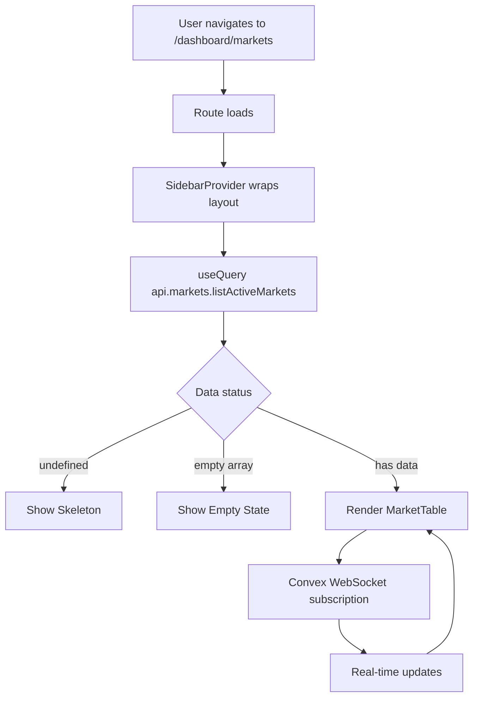

# feat: Real-Time Prediction Market Dashboard

> Build a beautiful real-time dashboard for Hermes with market data table, AI insights, and shadcn sidebar navigation.

## Overview

Create a production-ready dashboard for the Hermes AI-powered prediction market platform. The dashboard displays real-time market data from Convex, AI consensus insights, and uses the shadcn/ui sidebar for navigation. Matches the existing dark theme with cyan/emerald accents.

## Problem Statement / Motivation

Users need a central dashboard to:
1. Monitor active prediction markets in real-time
2. View AI model consensus on market outcomes
3. Track their watchlisted markets
4. Quickly identify high-confidence trading opportunities

Currently, there's only a landing page - no authenticated user experience exists.

## Technical Context

**Existing Stack:**
- Frontend: TanStack Start (React 19.2.0) with TanStack Router (file-based)
- Backend: Convex (real-time serverless database)
- UI: shadcn/ui components (17 installed) + Tailwind CSS v4
- Auth: Better Auth (already integrated)

**Existing Convex Queries:**
- `api.markets.listActiveMarkets` - Active markets sorted by volume/recent/ending_soon
- `api.insights.getLatestInsights` - AI consensus with market data
- `api.markets.getMarketSnapshots` - Price history for charts

**Existing Components:**
- `Sidebar` - Full shadcn sidebar with provider
- `Card`, `Badge`, `Button` - Basic UI components
- Auth flow at `/auth` route

**Missing Components (need to install):**
- `Table` / `DataTable` (TanStack Table integration)
- `Dialog` (for market detail modal)
- `Tabs` (for view switching)

## Proposed Solution

### Architecture

```
apps/web/src/routes/
├── __root.tsx                    # Root layout (existing)
├── index.tsx                     # Landing page (existing)
├── (auth)/                       # Auth routes (existing)
└── dashboard/                    # NEW: Dashboard routes
    ├── route.tsx                 # Dashboard layout with sidebar
    ├── index.tsx                 # Dashboard home (redirect to markets)
    ├── markets/
    │   └── index.tsx             # Markets table view
    ├── insights/
    │   └── index.tsx             # AI insights feed
    └── -components/              # Dashboard-specific components
        ├── app-sidebar.tsx       # Navigation sidebar
        ├── market-table.tsx      # Real-time market data table
        ├── market-columns.tsx    # TanStack Table column definitions
        ├── insight-card.tsx      # AI consensus display card
        ├── stats-cards.tsx       # KPI summary cards
        └── market-detail-dialog.tsx  # Market detail modal
```

### Data Flow



## Implementation Phases

### Phase 1: Foundation (Dashboard Shell)

**Goal:** Basic dashboard with sidebar navigation, empty page structure

**Files to create:**

#### `apps/web/src/routes/dashboard/route.tsx`
```tsx
// Dashboard layout with SidebarProvider
import { createFileRoute, Outlet, redirect } from "@tanstack/react-router";
import { SidebarProvider, SidebarInset } from "@/components/ui/sidebar";
import { AppSidebar } from "./-components/app-sidebar";

export const Route = createFileRoute("/dashboard")({
  beforeLoad: ({ context }) => {
    if (!context.isAuthenticated) {
      throw redirect({ to: "/auth" });
    }
  },
  component: DashboardLayout,
});

function DashboardLayout() {
  return (
    <SidebarProvider>
      <AppSidebar />
      <SidebarInset>
        <Outlet />
      </SidebarInset>
    </SidebarProvider>
  );
}
```

#### `apps/web/src/routes/dashboard/-components/app-sidebar.tsx`
```tsx
// Navigation sidebar with Markets, Insights, Watchlists sections
// Use existing Sidebar components from @/components/ui/sidebar
// Navigation items: Markets (default), Insights, Watchlists
// Footer: User profile with dropdown menu
```

#### `apps/web/src/routes/dashboard/index.tsx`
```tsx
// Redirect to /dashboard/markets
import { createFileRoute, redirect } from "@tanstack/react-router";

export const Route = createFileRoute("/dashboard/")({
  beforeLoad: () => {
    throw redirect({ to: "/dashboard/markets" });
  },
});
```

**Success Criteria:**
- [ ] User can navigate to `/dashboard` and see sidebar
- [ ] Sidebar has Markets, Insights, Watchlists navigation items
- [ ] Unauthenticated users redirect to `/auth`
- [ ] Sidebar is responsive (icon-only on desktop collapse, sheet on mobile)

---

### Phase 2: Core Data Table

**Goal:** Real-time market table with sorting, filtering, and Convex integration

**Dependencies to install:**
```bash
bun add @tanstack/react-table
bunx shadcn@latest add table dialog
```

**Files to create:**

#### `apps/web/src/routes/dashboard/markets/index.tsx`
```tsx
// Markets page with real-time data table
import { useQuery } from "convex/react";
import { api } from "@convex/_generated/api";
import { MarketTable } from "../-components/market-table";
import { StatsCards } from "../-components/stats-cards";

function MarketsPage() {
  const markets = useQuery(api.markets.listActiveMarkets, {
    sortBy: "volume",
    limit: 50,
  });

  return (
    <div className="flex flex-col gap-6 p-6">
      <header>
        <h1>Active Markets</h1>
        <p>Real-time prediction market data</p>
      </header>

      <StatsCards markets={markets} />

      <MarketTable data={markets ?? []} isLoading={markets === undefined} />
    </div>
  );
}
```

#### `apps/web/src/routes/dashboard/-components/market-table.tsx`
```tsx
// TanStack Table with real-time Convex data
// Features: sorting (volume, price, recent), search filter, row click for detail
// Columns: Title, Current Price, 24h Volume, AI Consensus, Actions
// Uses shadcn Table components
```

#### `apps/web/src/routes/dashboard/-components/market-columns.tsx`
```tsx
// Column definitions for TanStack Table
// - title: Market question/title
// - currentYesPrice: Formatted as percentage with color coding
// - volume24h: Formatted as currency
// - consensus: Badge with YES/NO/NO_TRADE + confidence
// - actions: View detail button
```

#### `apps/web/src/routes/dashboard/-components/stats-cards.tsx`
```tsx
// KPI summary cards at top of dashboard
// - Total Active Markets count
// - High Confidence Insights count
// - 24h Volume sum
// Uses Card component with animated numbers
```

**Success Criteria:**
- [ ] Markets table shows real-time data from Convex
- [ ] Table updates automatically when Convex data changes
- [ ] User can sort by volume, price, or recent
- [ ] User can search markets by title
- [ ] Loading state shows skeleton
- [ ] Empty state shows appropriate message

---

### Phase 3: AI Insights Integration

**Goal:** Display AI consensus alongside markets, detail view with model predictions

**Files to create:**

#### `apps/web/src/routes/dashboard/-components/market-detail-dialog.tsx`
```tsx
// Modal showing full market details
// - Market title and description
// - Price chart (using marketSnapshots data)
// - AI consensus with aggregatedReasoning
// - Individual model predictions (from modelPredictions table)
// - Add to watchlist button
```

#### `apps/web/src/routes/dashboard/insights/index.tsx`
```tsx
// Dedicated insights feed page
// Shows latest AI analysis runs
// Filter by confidence level (high/medium/low)
// Card-based layout with InsightCard component
```

#### `apps/web/src/routes/dashboard/-components/insight-card.tsx`
```tsx
// Card displaying single insight
// - Market title
// - Consensus decision with confidence badge
// - Agreeing/total models count
// - Truncated reasoning with expand
// - Link to full market detail
```

**Success Criteria:**
- [ ] Clicking market row opens detail dialog
- [ ] Detail shows AI reasoning and model predictions
- [ ] Insights page shows latest analysis
- [ ] High confidence insights are visually highlighted
- [ ] User can filter insights by confidence level

---

### Phase 4: Watchlist & Polish

**Goal:** Watchlist functionality, animations, mobile responsiveness

**Files to create:**

#### `apps/web/src/routes/dashboard/watchlists/index.tsx`
```tsx
// Watchlist management page
// Shows user's watchlisted markets
// Uses same MarketTable component with watchlist filter
// Add/remove from watchlist actions
```

**Enhancements:**
- [ ] Add row highlight animation for real-time price changes
- [ ] Implement mobile card view for tables (<768px)
- [ ] Add toast notifications for watchlist actions
- [ ] Implement keyboard navigation (arrows, enter, escape)
- [ ] Add `prefers-reduced-motion` support

**Success Criteria:**
- [ ] User can add/remove markets from watchlist
- [ ] Watchlist persists across sessions
- [ ] Mobile layout uses card view
- [ ] Animations respect user preferences

---

## Technical Specifications

### Convex Query Integration with TanStack Start

The project already has `convexQueryClient` configured in `apps/web/src/lib/providers/query.tsx`. Use the existing setup with route loaders for SSR prefetching.

```typescript
// apps/web/src/routes/dashboard/markets/index.tsx
import { createFileRoute } from "@tanstack/react-router";
import { convexQuery } from "@convex-dev/react-query";
import { useSuspenseQuery } from "@tanstack/react-query";
import { api } from "backend/convex/_generated/api";

export const Route = createFileRoute("/dashboard/markets/")({
  // SSR: Prefetch data in loader for instant first render
  loader: async ({ context }) => {
    await context.queryClient.ensureQueryData(
      convexQuery(api.markets.listActiveMarkets, { sortBy: "volume", limit: 50 })
    );
  },
  component: MarketsPage,
});

function MarketsPage() {
  // Client: Real-time subscription (automatic updates via WebSocket)
  const { data: markets } = useSuspenseQuery(
    convexQuery(api.markets.listActiveMarkets, { sortBy: "volume", limit: 50 })
  );

  // Queries stay subscribed for gcTime (default 5 min) even after unmount
  // This enables seamless client-side navigation without resubscribing

  return <MarketTable data={markets} />;
}
```

**Key Patterns:**
- Use `convexQuery()` wrapper for TanStack Query integration
- Use `useSuspenseQuery()` for cleanest SSR experience
- Prefetch in route `loader` for instant server render
- Convex uses same timestamp for all queries during SSR (consistency)
- Access `queryClient` and `convexQueryClient` from route context (already configured in `__root.tsx`)

### Import Path for Backend API

The lofn app shows the correct import pattern:
```typescript
// Correct: Import from backend package
import { api } from "backend/convex/_generated/api";
import type { Id, Doc } from "backend/convex/_generated/dataModel";
```

### DataTable Component Setup (shadcn pattern)

Install dependencies and add shadcn table component:
```bash
bun add @tanstack/react-table
bunx shadcn@latest add table
```

**DataTable Component Structure:**
```typescript
// apps/web/src/routes/dashboard/-components/data-table.tsx
"use client"

import * as React from "react"
import {
  ColumnDef,
  ColumnFiltersState,
  SortingState,
  VisibilityState,
  flexRender,
  getCoreRowModel,
  getFilteredRowModel,
  getPaginationRowModel,
  getSortedRowModel,
  useReactTable,
} from "@tanstack/react-table"

import {
  Table,
  TableBody,
  TableCell,
  TableHead,
  TableHeader,
  TableRow,
} from "@/components/ui/table"
import { Button } from "@/components/ui/button"
import { Input } from "@/components/ui/input"

interface DataTableProps<TData, TValue> {
  columns: ColumnDef<TData, TValue>[]
  data: TData[]
  searchKey?: string
  searchPlaceholder?: string
}

export function DataTable<TData, TValue>({
  columns,
  data,
  searchKey = "title",
  searchPlaceholder = "Filter markets...",
}: DataTableProps<TData, TValue>) {
  const [sorting, setSorting] = React.useState<SortingState>([])
  const [columnFilters, setColumnFilters] = React.useState<ColumnFiltersState>([])
  const [columnVisibility, setColumnVisibility] = React.useState<VisibilityState>({})

  const table = useReactTable({
    data,
    columns,
    onSortingChange: setSorting,
    onColumnFiltersChange: setColumnFilters,
    getCoreRowModel: getCoreRowModel(),
    getPaginationRowModel: getPaginationRowModel(),
    getSortedRowModel: getSortedRowModel(),
    getFilteredRowModel: getFilteredRowModel(),
    onColumnVisibilityChange: setColumnVisibility,
    state: {
      sorting,
      columnFilters,
      columnVisibility,
    },
  })

  return (
    <div className="w-full">
      <div className="flex items-center py-4">
        <Input
          placeholder={searchPlaceholder}
          value={(table.getColumn(searchKey)?.getFilterValue() as string) ?? ""}
          onChange={(event) =>
            table.getColumn(searchKey)?.setFilterValue(event.target.value)
          }
          className="max-w-sm"
        />
      </div>
      <div className="overflow-hidden rounded-md border">
        <Table>
          <TableHeader>
            {table.getHeaderGroups().map((headerGroup) => (
              <TableRow key={headerGroup.id}>
                {headerGroup.headers.map((header) => (
                  <TableHead key={header.id}>
                    {header.isPlaceholder
                      ? null
                      : flexRender(header.column.columnDef.header, header.getContext())}
                  </TableHead>
                ))}
              </TableRow>
            ))}
          </TableHeader>
          <TableBody>
            {table.getRowModel().rows?.length ? (
              table.getRowModel().rows.map((row) => (
                <TableRow key={row.id}>
                  {row.getVisibleCells().map((cell) => (
                    <TableCell key={cell.id}>
                      {flexRender(cell.column.columnDef.cell, cell.getContext())}
                    </TableCell>
                  ))}
                </TableRow>
              ))
            ) : (
              <TableRow>
                <TableCell colSpan={columns.length} className="h-24 text-center">
                  No results.
                </TableCell>
              </TableRow>
            )}
          </TableBody>
        </Table>
      </div>
      {/* Pagination */}
      <div className="flex items-center justify-end space-x-2 py-4">
        <Button
          variant="outline"
          size="sm"
          onClick={() => table.previousPage()}
          disabled={!table.getCanPreviousPage()}
        >
          Previous
        </Button>
        <Button
          variant="outline"
          size="sm"
          onClick={() => table.nextPage()}
          disabled={!table.getCanNextPage()}
        >
          Next
        </Button>
      </div>
    </div>
  )
}
```

### Table Column Definitions

```typescript
// apps/web/src/routes/dashboard/-components/market-columns.tsx
"use client"

import { ColumnDef } from "@tanstack/react-table"
import { ArrowUpDown } from "lucide-react"
import { Badge } from "@/components/ui/badge"
import { Button } from "@/components/ui/button"
import type { Doc } from "backend/convex/_generated/dataModel"

type Market = Doc<"markets"> & {
  insight?: Doc<"insights">;
};

export const columns: ColumnDef<Market>[] = [
  {
    accessorKey: "title",
    header: ({ column }) => (
      <Button
        variant="ghost"
        onClick={() => column.toggleSorting(column.getIsSorted() === "asc")}
      >
        Market
        <ArrowUpDown className="ml-2 h-4 w-4" />
      </Button>
    ),
    cell: ({ row }) => (
      <div className="max-w-[400px] truncate font-medium">
        {row.getValue("title")}
      </div>
    ),
  },
  {
    accessorKey: "currentYesPrice",
    header: ({ column }) => (
      <Button
        variant="ghost"
        onClick={() => column.toggleSorting(column.getIsSorted() === "asc")}
      >
        YES Price
        <ArrowUpDown className="ml-2 h-4 w-4" />
      </Button>
    ),
    cell: ({ row }) => {
      const price = row.getValue("currentYesPrice") as number;
      return (
        <span className={price > 0.5 ? "text-emerald-500" : "text-red-500"}>
          {(price * 100).toFixed(1)}%
        </span>
      );
    },
  },
  {
    accessorKey: "volume24h",
    header: ({ column }) => (
      <Button
        variant="ghost"
        onClick={() => column.toggleSorting(column.getIsSorted() === "asc")}
      >
        24h Volume
        <ArrowUpDown className="ml-2 h-4 w-4" />
      </Button>
    ),
    cell: ({ row }) => {
      const volume = row.getValue("volume24h") as number;
      return `$${volume.toLocaleString()}`;
    },
  },
  {
    accessorKey: "insight.consensusDecision",
    header: "AI Consensus",
    cell: ({ row }) => {
      const insight = row.original.insight;
      if (!insight) return <Badge variant="outline">Pending</Badge>;

      const variant = insight.consensusDecision === "YES"
        ? "default"
        : insight.consensusDecision === "NO"
        ? "destructive"
        : "secondary";

      return (
        <Badge variant={variant}>
          {insight.consensusDecision} ({insight.consensusPercentage}%)
        </Badge>
      );
    },
  },
];
```

### Theme Colors (existing)

```css
/* From apps/web/src/styles.css */
--cyan: #22d3ee;
--emerald: #10b981;
--background: oklch(0.13 0.028 261.692); /* Dark */
--foreground: oklch(0.985 0.002 247.839); /* Light text */
--sidebar: oklch(0.21 0.034 264.665); /* Sidebar dark */
```

### Type Definitions

```typescript
// apps/web/src/types/dashboard.ts
import type { Doc, Id } from "@convex/_generated/dataModel";

export type Market = Doc<"markets">;
export type Insight = Doc<"insights">;
export type ModelPrediction = Doc<"modelPredictions">;

export type MarketWithInsight = Market & {
  insight?: Insight;
};

export type InsightWithPredictions = Insight & {
  predictions: ModelPrediction[];
  market: Market;
};

export type SortOption = "volume" | "recent" | "ending_soon";
export type ConfidenceLevel = "high" | "medium" | "low";
```

---

## Acceptance Criteria

### Functional Requirements

- [ ] Dashboard requires authentication (redirect to `/auth` if not logged in)
- [ ] Sidebar navigation between Markets, Insights, and Watchlists
- [ ] Markets table displays real-time data from Convex
- [ ] Table supports sorting by volume, price, and recency
- [ ] Table supports search/filter by market title
- [ ] Clicking market row opens detail dialog with AI reasoning
- [ ] AI consensus displayed with confidence badges
- [ ] User can add/remove markets from watchlist
- [ ] Data updates in real-time without manual refresh

### Non-Functional Requirements

- [ ] Initial load < 2 seconds on 3G connection
- [ ] Table handles 500+ markets without lag (virtualization if needed)
- [ ] Responsive layout: desktop sidebar, mobile bottom nav
- [ ] Accessible: keyboard navigation, screen reader labels
- [ ] Animations respect `prefers-reduced-motion`

### Quality Gates

- [ ] TypeScript: No `any` types, full type coverage
- [ ] All Convex queries typed with generated types
- [ ] Components use proper loading/error states
- [ ] Mobile viewport tested (375px, 768px, 1024px)

---

## Dependencies & Prerequisites

**Required before starting:**
1. Convex backend running with seeded market data
2. Better Auth configured and working
3. User authenticated session available in route context

**Packages to install:**
```bash
bun add @tanstack/react-table
bunx shadcn@latest add table dialog tabs tooltip
```

**Environment variables:**
- `VITE_CONVEX_URL` - Convex deployment URL (already configured)

---

## Risk Analysis & Mitigation

| Risk | Likelihood | Impact | Mitigation |
|------|------------|--------|------------|
| Convex connection drops | Medium | High | Implement reconnection banner, auto-retry |
| Too many real-time updates | Low | Medium | Debounce updates, batch animations |
| Table performance with 1000+ rows | Low | Medium | Implement virtualization with TanStack Virtual |
| Mobile UX complexity | Medium | Medium | Start with mobile-first design |

---

## File Checklist

### Phase 1 - Foundation
- [ ] `apps/web/src/routes/dashboard/route.tsx` - Dashboard layout
- [ ] `apps/web/src/routes/dashboard/index.tsx` - Redirect to markets
- [ ] `apps/web/src/routes/dashboard/-components/app-sidebar.tsx` - Navigation

### Phase 2 - Data Table
- [ ] `apps/web/src/routes/dashboard/markets/index.tsx` - Markets page
- [ ] `apps/web/src/routes/dashboard/-components/market-table.tsx` - Table component
- [ ] `apps/web/src/routes/dashboard/-components/market-columns.tsx` - Column defs
- [ ] `apps/web/src/routes/dashboard/-components/stats-cards.tsx` - KPI cards

### Phase 3 - Insights
- [ ] `apps/web/src/routes/dashboard/-components/market-detail-dialog.tsx` - Detail modal
- [ ] `apps/web/src/routes/dashboard/insights/index.tsx` - Insights page
- [ ] `apps/web/src/routes/dashboard/-components/insight-card.tsx` - Insight card

### Phase 4 - Watchlist & Polish
- [ ] `apps/web/src/routes/dashboard/watchlists/index.tsx` - Watchlist page
- [ ] Mobile responsive enhancements
- [ ] Animation polish

---

## References

### Internal References
- `apps/web/src/components/ui/sidebar.tsx` - Existing sidebar component
- `apps/web/src/routes/(auth)/` - Auth flow patterns
- `apps/web/src/lib/providers/query.tsx` - Convex + TanStack Query setup
- `packages/backend/convex/schema.ts` - Database schema
- `packages/backend/convex/markets.ts` - Market queries
- `packages/backend/convex/insights.ts` - Insight queries

### External References
- [Convex React Hooks](https://docs.convex.dev/client/react)
- [shadcn/ui Sidebar](https://ui.shadcn.com/docs/components/sidebar)
- [TanStack Table](https://tanstack.com/table/latest)
- [TanStack Router File-Based Routing](https://tanstack.com/router/latest/docs/framework/react/guide/file-based-routing)

---

## Notes

- Use existing dark theme colors (cyan/emerald accents) from landing page
- Match glassmorphism style from auth page for cards
- Real-time updates via Convex WebSocket - no polling needed
- Consider adding sparkline charts for price trends in Phase 3+

