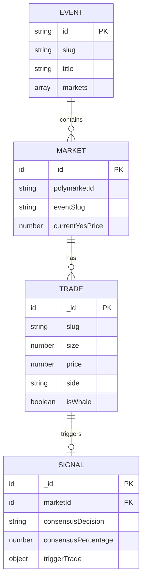

# ✨ feat: Frontend Convex Integration & Query Organization

## Overview

Update the frontend to integrate with the newly refactored Convex backend, establishing proper query organization in the lib folder, with a simplified two-page architecture focused on **Trades/Signals** and **Events/Markets**.

## Problem Statement

The current frontend has:

- Query options defined **inline** in components (not reusable)
- Too many separate pages without clear relationships
- Missing integration with new Polymarket API client (`convex/polymarket/*`)
- No clear data hierarchy (events → markets → trades → signals)

## Proposed Solution

### Simplified Architecture

**Two Core Pages:**

1. **Trades Page** - Live whale trades feed with AI signals
   - Real-time trade stream
   - Signal cards showing AI consensus
   - Click trade → see event, market, signal details, stats

2. **Events Page** - Polymarket events with their markets
   - Event cards with nested markets
   - Click event → expand to show markets
   - Click market → see trades, signals, stats for that market

**Key Principle:** Everything is connected. A trade links to its market, which links to its event, which shows all signals.

---

## Technical Approach

### Architecture

```
apps/web/src/
├── lib/
│   ├── queries/                    # Query factories
│   │   ├── index.ts
│   │   ├── markets.ts
│   │   ├── trades.ts
│   │   ├── signals.ts
│   │   └── events.ts              # Polymarket API actions
│   └── providers/
│       └── query.tsx              # Stale time + revalidateIfStale
├── routes/
│   └── dashboard/
│       ├── trades/                # Trades + Signals combined
│       │   ├── index.tsx          # Loader with ensureQueryData
│       │   └── -components/
│       │       ├── trade-feed.tsx
│       │       ├── signal-card.tsx
│       │       └── trade-detail-modal.tsx
│       └── events/                # Events + Markets combined
│           ├── index.tsx          # Loader with ensureQueryData
│           ├── $slug.tsx          # Event detail with markets
│           └── -components/
│               ├── event-card.tsx
│               ├── market-card.tsx
│               └── market-detail-modal.tsx
```

### Data Hierarchy

```
Event (Polymarket)
  └── Market (our stored data)
        ├── Trades (whale trades)
        │     └── Signal (AI analysis of trade)
        └── Snapshots (price history)
```

### SSR & Prefetching Strategy

Use TanStack Router loaders with `ensureQueryData` for SSR:

```typescript
// Pattern for all pages
export const Route = createFileRoute("/dashboard/trades/")({
  loader: async ({ context }) => {
    // Prefetch with short stale time for fast subsequent visits
    await context.queryClient.ensureQueryData({
      ...signalQueries.latest({ limit: 20 }),
      staleTime: 30 * 1000, // 30s frontend cache
      revalidateIfStale: true,
    });
  },
  component: TradesPage,
});
```

### Query Configuration

```typescript
// lib/providers/query.tsx
const queryClient = new QueryClient({
  defaultOptions: {
    queries: {
      queryKeyHashFn: convexQueryClient.hashFn(),
      queryFn: convexQueryClient.queryFn(),
      staleTime: 30 * 1000,        // 30 second default
      gcTime: 5 * 60 * 1000,       // 5 minute garbage collection
      refetchOnWindowFocus: false,
      retry: 1,
    },
  },
});
```

---

## Implementation Phases

### Phase 1: Query Infrastructure

#### lib/queries/markets.ts

```typescript
import { convexQuery } from "@convex-dev/react-query";
import { api } from "backend/convex/_generated/api";
import type { Id } from "backend/convex/_generated/dataModel";

export const marketQueries = {
  list: (options?: { limit?: number; sortBy?: "volume" | "recent" }) => ({
    ...convexQuery(api.markets.listActiveMarkets, {
      limit: options?.limit ?? 50,
      sortBy: options?.sortBy ?? "volume",
    }),
    staleTime: 30 * 1000,
  }),

  detail: (marketId: Id<"markets"> | null) => ({
    ...convexQuery(api.markets.getMarket, { marketId }),
    staleTime: 10 * 1000, // Shorter for detail views
  }),

  byEventSlug: (eventSlug: string) => ({
    ...convexQuery(api.markets.searchMarkets, { query: eventSlug, limit: 50 }),
    staleTime: 60 * 1000,
  }),

  snapshots: (marketId: Id<"markets">, since?: number) => ({
    ...convexQuery(api.markets.getMarketSnapshots, {
      marketId,
      since: since ?? Date.now() - 24 * 60 * 60 * 1000,
    }),
    staleTime: 60 * 1000,
  }),
};
```

#### lib/queries/signals.ts

```typescript
import { convexQuery } from "@convex-dev/react-query";
import { api } from "backend/convex/_generated/api";
import type { Id } from "backend/convex/_generated/dataModel";

export const signalQueries = {
  latest: (options?: { limit?: number; onlyHighConfidence?: boolean }) => ({
    ...convexQuery(api.signals.getLatestSignals, {
      limit: options?.limit ?? 20,
      onlyHighConfidence: options?.onlyHighConfidence ?? false,
    }),
    staleTime: 30 * 1000,
  }),

  byMarket: (marketId: Id<"markets"> | null) => ({
    ...convexQuery(api.signals.getSignalsByMarket, { marketId, limit: 20 }),
    staleTime: 30 * 1000,
  }),

  detail: (signalId: Id<"signals">) => ({
    ...convexQuery(api.signals.getSignalWithPredictions, { signalId }),
    staleTime: 60 * 1000,
  }),

  stats: () => ({
    ...convexQuery(api.signals.getSignalStats, {}),
    staleTime: 60 * 1000,
  }),
};
```

#### lib/queries/trades.ts

```typescript
import { convexQuery } from "@convex-dev/react-query";
import { api } from "backend/convex/_generated/api";

export const tradeQueries = {
  recent: (limit?: number) => ({
    ...convexQuery(api.trades.getRecentTrades, { limit: limit ?? 100 }),
    staleTime: 10 * 1000, // Short for live data
  }),

  whales: (options?: { limit?: number }) => ({
    ...convexQuery(api.trades.getWhaleTrades, { limit: options?.limit ?? 50 }),
    staleTime: 10 * 1000,
  }),

  bySlug: (slug: string, limit?: number) => ({
    ...convexQuery(api.trades.getTradesBySlug, { slug, limit: limit ?? 50 }),
    staleTime: 30 * 1000,
  }),
};
```

#### lib/queries/events.ts

```typescript
import { convexAction } from "@convex-dev/react-query";
import { api } from "backend/convex/_generated/api";

export const eventActions = {
  list: (options?: { limit?: number; active?: boolean }) => ({
    ...convexAction(api.polymarket.listEvents, {
      limit: options?.limit ?? 50,
      active: options?.active ?? true,
    }),
    staleTime: 5 * 60 * 1000, // 5 min cache for external API
  }),

  bySlug: (slug: string) => ({
    ...convexAction(api.polymarket.getEventBySlug, { slug }),
    staleTime: 5 * 60 * 1000,
  }),
};
```

#### lib/queries/index.ts

```typescript
export { marketQueries } from "./markets";
export { signalQueries } from "./signals";
export { tradeQueries } from "./trades";
export { eventActions } from "./events";
export { convexQuery, convexAction, useConvexMutation } from "@convex-dev/react-query";
```

---

### Phase 2: Trades Page (Trades + Signals)

#### routes/dashboard/trades/index.tsx

```typescript
import { createFileRoute } from "@tanstack/react-router";
import { useQuery } from "@tanstack/react-query";
import { signalQueries, tradeQueries } from "@/lib/queries";
import { TradeFeed } from "./-components/trade-feed";
import { SignalCard } from "./-components/signal-card";
import { TradeDetailModal } from "./-components/trade-detail-modal";
import { LoadingSkeleton, EmptyState } from "@/components/ui/data-states";
import { useState } from "react";

export const Route = createFileRoute("/dashboard/trades/")({
  loader: async ({ context }) => {
    // SSR prefetch with ensureQueryData
    await Promise.all([
      context.queryClient.ensureQueryData({
        ...signalQueries.latest({ limit: 10, onlyHighConfidence: true }),
        revalidateIfStale: true,
      }),
      context.queryClient.ensureQueryData({
        ...tradeQueries.whales({ limit: 50 }),
        revalidateIfStale: true,
      }),
    ]);
  },
  component: TradesPage,
});

function TradesPage() {
  const [selectedTradeId, setSelectedTradeId] = useState<string | null>(null);

  const { data: signals, isLoading: signalsLoading } = useQuery(
    signalQueries.latest({ limit: 10, onlyHighConfidence: true })
  );

  const { data: trades, isLoading: tradesLoading } = useQuery(
    tradeQueries.whales({ limit: 50 })
  );

  return (
    <div className="space-y-8">
      {/* Header */}
      <div>
        <h1 className="text-3xl font-bold tracking-tight">Live Trades</h1>
        <p className="text-muted-foreground">
          Real-time whale trades with AI-powered signals
        </p>
      </div>

      {/* High Confidence Signals Section */}
      <section>
        <h2 className="text-xl font-semibold mb-4">🎯 High Confidence Signals</h2>
        {signalsLoading ? (
          <LoadingSkeleton variant="card" count={3} />
        ) : signals?.length === 0 ? (
          <EmptyState title="No signals yet" description="AI signals appear when whale trades are detected" />
        ) : (
          <div className="grid gap-4 md:grid-cols-2 lg:grid-cols-3">
            {signals?.map((signal) => (
              <SignalCard
                key={signal._id}
                signal={signal}
                onClick={() => setSelectedTradeId(signal._id)}
              />
            ))}
          </div>
        )}
      </section>

      {/* Live Trade Feed Section */}
      <section>
        <h2 className="text-xl font-semibold mb-4">📊 Whale Trade Feed</h2>
        {tradesLoading ? (
          <LoadingSkeleton variant="table-row" count={10} />
        ) : trades?.length === 0 ? (
          <EmptyState title="No trades yet" description="Whale trades will appear here in real-time" />
        ) : (
          <TradeFeed trades={trades ?? []} onTradeClick={setSelectedTradeId} />
        )}
      </section>

      {/* Trade Detail Modal - shows event, market, signal, stats */}
      <TradeDetailModal
        tradeId={selectedTradeId}
        open={!!selectedTradeId}
        onClose={() => setSelectedTradeId(null)}
      />
    </div>
  );
}
```

#### routes/dashboard/trades/-components/trade-detail-modal.tsx

```typescript
import { Dialog, DialogContent, DialogHeader, DialogTitle } from "@/components/ui/dialog";
import { useQuery } from "@tanstack/react-query";
import { marketQueries, signalQueries, eventActions } from "@/lib/queries";
import { Badge } from "@/components/ui/badge";
import { Card, CardContent, CardHeader, CardTitle } from "@/components/ui/card";
import { Tabs, TabsContent, TabsList, TabsTrigger } from "@/components/ui/tabs";
import type { Id } from "backend/convex/_generated/dataModel";

interface TradeDetailModalProps {
  tradeId: string | null;
  open: boolean;
  onClose: () => void;
}

export function TradeDetailModal({ tradeId, open, onClose }: TradeDetailModalProps) {
  // Fetch related data when modal opens
  const { data: signal } = useQuery({
    ...signalQueries.detail(tradeId as Id<"signals">),
    enabled: !!tradeId && open,
  });

  const { data: market } = useQuery({
    ...marketQueries.detail(signal?.marketId ?? null),
    enabled: !!signal?.marketId && open,
  });

  const { data: event } = useQuery({
    ...eventActions.bySlug(market?.eventSlug ?? ""),
    enabled: !!market?.eventSlug && open,
  });

  return (
    <Dialog open={open} onOpenChange={() => onClose()}>
      <DialogContent className="max-w-4xl max-h-[90vh] overflow-y-auto">
        <DialogHeader>
          <DialogTitle>{market?.title ?? "Trade Details"}</DialogTitle>
        </DialogHeader>

        <Tabs defaultValue="signal" className="mt-4">
          <TabsList className="grid w-full grid-cols-4">
            <TabsTrigger value="signal">Signal</TabsTrigger>
            <TabsTrigger value="market">Market</TabsTrigger>
            <TabsTrigger value="event">Event</TabsTrigger>
            <TabsTrigger value="stats">Stats</TabsTrigger>
          </TabsList>

          <TabsContent value="signal" className="mt-4">
            {signal && (
              <Card>
                <CardHeader>
                  <CardTitle className="flex items-center gap-2">
                    AI Consensus:
                    <Badge variant={signal.consensusDecision === "YES" ? "default" : "destructive"}>
                      {signal.consensusDecision}
                    </Badge>
                    <span className="text-sm font-normal text-muted-foreground">
                      ({signal.consensusPercentage}% agreement)
                    </span>
                  </CardTitle>
                </CardHeader>
                <CardContent>
                  <p className="text-sm">{signal.aggregatedReasoning}</p>
                  {signal.aggregatedKeyFactors && (
                    <div className="mt-4">
                      <h4 className="font-semibold mb-2">Key Factors</h4>
                      <ul className="list-disc list-inside text-sm">
                        {signal.aggregatedKeyFactors.map((factor, i) => (
                          <li key={i}>{factor}</li>
                        ))}
                      </ul>
                    </div>
                  )}
                </CardContent>
              </Card>
            )}
          </TabsContent>

          <TabsContent value="market" className="mt-4">
            {market && (
              <Card>
                <CardHeader>
                  <CardTitle>{market.title}</CardTitle>
                </CardHeader>
                <CardContent className="space-y-4">
                  <div className="grid grid-cols-2 gap-4">
                    <div>
                      <p className="text-sm text-muted-foreground">YES Price</p>
                      <p className="text-2xl font-bold text-green-600">
                        {(market.currentYesPrice * 100).toFixed(1)}%
                      </p>
                    </div>
                    <div>
                      <p className="text-sm text-muted-foreground">24h Volume</p>
                      <p className="text-2xl font-bold">
                        ${market.volume24h.toLocaleString()}
                      </p>
                    </div>
                  </div>
                </CardContent>
              </Card>
            )}
          </TabsContent>

          <TabsContent value="event" className="mt-4">
            {event && (
              <Card>
                <CardHeader>
                  <CardTitle>{event.title}</CardTitle>
                </CardHeader>
                <CardContent>
                  <p className="text-sm text-muted-foreground">{event.description}</p>
                  <div className="mt-4">
                    <p className="text-sm">
                      <span className="font-semibold">{event.markets?.length ?? 0}</span> markets in this event
                    </p>
                  </div>
                </CardContent>
              </Card>
            )}
          </TabsContent>

          <TabsContent value="stats" className="mt-4">
            <div className="grid grid-cols-2 gap-4">
              <Card>
                <CardHeader>
                  <CardTitle className="text-base">Trade Details</CardTitle>
                </CardHeader>
                <CardContent>
                  {signal?.triggerTrade && (
                    <dl className="space-y-2 text-sm">
                      <div className="flex justify-between">
                        <dt className="text-muted-foreground">Size</dt>
                        <dd className="font-mono">${signal.triggerTrade.size?.toLocaleString()}</dd>
                      </div>
                      <div className="flex justify-between">
                        <dt className="text-muted-foreground">Price</dt>
                        <dd className="font-mono">{(signal.triggerTrade.price * 100).toFixed(1)}%</dd>
                      </div>
                      <div className="flex justify-between">
                        <dt className="text-muted-foreground">Side</dt>
                        <dd>{signal.triggerTrade.side}</dd>
                      </div>
                    </dl>
                  )}
                </CardContent>
              </Card>
              <Card>
                <CardHeader>
                  <CardTitle className="text-base">AI Models</CardTitle>
                </CardHeader>
                <CardContent>
                  {signal && (
                    <dl className="space-y-2 text-sm">
                      <div className="flex justify-between">
                        <dt className="text-muted-foreground">Models</dt>
                        <dd>{signal.agreeingModels}/{signal.totalModels} agree</dd>
                      </div>
                      <div className="flex justify-between">
                        <dt className="text-muted-foreground">Confidence</dt>
                        <dd>{signal.confidenceLevel}</dd>
                      </div>
                    </dl>
                  )}
                </CardContent>
              </Card>
            </div>
          </TabsContent>
        </Tabs>
      </DialogContent>
    </Dialog>
  );
}
```

---

### Phase 3: Events Page (Events + Markets)

#### routes/dashboard/events/index.tsx

```typescript
import { createFileRoute } from "@tanstack/react-router";
import { useQuery } from "@tanstack/react-query";
import { eventActions, marketQueries } from "@/lib/queries";
import { EventCard } from "./-components/event-card";
import { LoadingSkeleton, EmptyState } from "@/components/ui/data-states";
import { Button } from "@/components/ui/button";
import { RefreshCw } from "lucide-react";

export const Route = createFileRoute("/dashboard/events/")({
  loader: async ({ context }) => {
    await context.queryClient.ensureQueryData({
      ...eventActions.list({ limit: 30, active: true }),
      revalidateIfStale: true,
    });
  },
  component: EventsPage,
});

function EventsPage() {
  const { data: events, isLoading, refetch, isFetching } = useQuery(
    eventActions.list({ limit: 30, active: true })
  );

  return (
    <div className="space-y-8">
      {/* Header */}
      <div className="flex justify-between items-center">
        <div>
          <h1 className="text-3xl font-bold tracking-tight">Events</h1>
          <p className="text-muted-foreground">
            Browse Polymarket events and their markets
          </p>
        </div>
        <Button onClick={() => refetch()} variant="outline" disabled={isFetching}>
          <RefreshCw className={`h-4 w-4 mr-2 ${isFetching ? "animate-spin" : ""}`} />
          Refresh
        </Button>
      </div>

      {/* Events Grid */}
      {isLoading ? (
        <LoadingSkeleton variant="card" count={6} />
      ) : events?.length === 0 ? (
        <EmptyState
          title="No events found"
          description="No active Polymarket events at the moment"
        />
      ) : (
        <div className="grid gap-6 md:grid-cols-2 lg:grid-cols-3">
          {events?.map((event) => (
            <EventCard key={event.id} event={event} />
          ))}
        </div>
      )}
    </div>
  );
}
```

#### routes/dashboard/events/-components/event-card.tsx

```typescript
import { Card, CardHeader, CardTitle, CardDescription, CardContent, CardFooter } from "@/components/ui/card";
import { Badge } from "@/components/ui/badge";
import { Button } from "@/components/ui/button";
import { ChevronDown, ChevronUp, TrendingUp, DollarSign } from "lucide-react";
import { useState } from "react";
import { MarketCard } from "./market-card";
import type { Event } from "backend/convex/polymarket/schemas";

interface EventCardProps {
  event: Event;
}

export function EventCard({ event }: EventCardProps) {
  const [expanded, setExpanded] = useState(false);
  const markets = event.markets ?? [];

  return (
    <Card className="flex flex-col">
      <CardHeader>
        {event.image && (
          
        )}
        <div className="flex items-start justify-between gap-2">
          <CardTitle className="line-clamp-2 text-lg">{event.title}</CardTitle>
          {event.active && <Badge>Active</Badge>}
        </div>
        <CardDescription className="line-clamp-2">
          {event.description}
        </CardDescription>
      </CardHeader>

      <CardContent className="flex-1">
        <div className="flex gap-4 text-sm text-muted-foreground">
          <div className="flex items-center gap-1">
            <TrendingUp className="h-4 w-4" />
            {markets.length} markets
          </div>
          {event.volume && (
            <div className="flex items-center gap-1">
              <DollarSign className="h-4 w-4" />
              ${(event.volume / 1_000_000).toFixed(1)}M volume
            </div>
          )}
        </div>
      </CardContent>

      {/* Expandable Markets Section */}
      {markets.length > 0 && (
        <>
          <CardFooter className="pt-0">
            <Button
              variant="ghost"
              className="w-full"
              onClick={() => setExpanded(!expanded)}
            >
              {expanded ? (
                <>Hide Markets <ChevronUp className="h-4 w-4 ml-2" /></>
              ) : (
                <>Show Markets <ChevronDown className="h-4 w-4 ml-2" /></>
              )}
            </Button>
          </CardFooter>

          {expanded && (
            <div className="px-6 pb-6 space-y-3">
              {markets.slice(0, 5).map((market) => (
                <MarketCard key={market.id} market={market} compact />
              ))}
              {markets.length > 5 && (
                <p className="text-sm text-muted-foreground text-center">
                  +{markets.length - 5} more markets
                </p>
              )}
            </div>
          )}
        </>
      )}
    </Card>
  );
}
```

#### routes/dashboard/events/-components/market-card.tsx

```typescript
import { Card, CardContent } from "@/components/ui/card";
import { Badge } from "@/components/ui/badge";
import { useQuery } from "@tanstack/react-query";
import { signalQueries, marketQueries } from "@/lib/queries";
import { MarketDetailModal } from "./market-detail-modal";
import { useState } from "react";
import type { Market } from "backend/convex/polymarket/schemas";

interface MarketCardProps {
  market: Market;
  compact?: boolean;
}

export function MarketCard({ market, compact }: MarketCardProps) {
  const [showDetail, setShowDetail] = useState(false);

  // Check if we have signals for this market
  const { data: ourMarket } = useQuery({
    ...marketQueries.byPolymarketId(market.id),
    enabled: !compact,
  });

  const { data: signals } = useQuery({
    ...signalQueries.byMarket(ourMarket?._id ?? null),
    enabled: !!ourMarket?._id && !compact,
  });

  const latestSignal = signals?.[0];
  const yesPrice = market.outcomePrices?.[0] ?? market.bestAsk ?? 0;

  if (compact) {
    return (
      <div
        className="flex items-center justify-between p-3 rounded-lg bg-muted/50 hover:bg-muted cursor-pointer transition-colors"
        onClick={() => setShowDetail(true)}
      >
        <span className="text-sm font-medium line-clamp-1 flex-1">
          {market.question ?? market.groupItemTitle}
        </span>
        <Badge variant="outline" className="ml-2">
          {(yesPrice * 100).toFixed(0)}%
        </Badge>
      </div>
    );
  }

  return (
    <>
      <Card
        className="cursor-pointer hover:border-primary transition-colors"
        onClick={() => setShowDetail(true)}
      >
        <CardContent className="p-4">
          <div className="flex items-start justify-between gap-4">
            <div className="flex-1">
              <p className="font-medium">{market.question ?? market.groupItemTitle}</p>
              <div className="flex gap-2 mt-2">
                <Badge variant="outline">
                  {(yesPrice * 100).toFixed(0)}% YES
                </Badge>
                {latestSignal && (
                  <Badge variant={latestSignal.consensusDecision === "YES" ? "default" : "secondary"}>
                    AI: {latestSignal.consensusDecision}
                  </Badge>
                )}
              </div>
            </div>
          </div>
        </CardContent>
      </Card>

      <MarketDetailModal
        market={market}
        ourMarket={ourMarket}
        signals={signals}
        open={showDetail}
        onClose={() => setShowDetail(false)}
      />
    </>
  );
}
```

---

### Phase 4: Update Navigation

#### routes/dashboard/-components/app-sidebar.tsx

```typescript
// Simplified navigation - just 2 main sections
const navItems = [
  {
    title: "Trades",
    href: "/dashboard/trades",
    icon: Activity,
    description: "Live trades & AI signals",
  },
  {
    title: "Events",
    href: "/dashboard/events",
    icon: Calendar,
    description: "Browse markets by event",
  },
];
```

---

### Phase 5: Shared Components

#### components/ui/data-states.tsx

```typescript
import { Skeleton } from "@/components/ui/skeleton";
import { AlertCircle, Inbox, Loader2 } from "lucide-react";
import { Button } from "@/components/ui/button";

interface LoadingSkeletonProps {
  variant: "card" | "table-row" | "detail";
  count?: number;
}

export function LoadingSkeleton({ variant, count = 3 }: LoadingSkeletonProps) {
  if (variant === "card") {
    return (
      <div className="grid gap-4 md:grid-cols-2 lg:grid-cols-3">
        {Array.from({ length: count }).map((_, i) => (
          <Skeleton key={i} className="h-64 rounded-xl" />
        ))}
      </div>
    );
  }

  if (variant === "table-row") {
    return (
      <div className="space-y-2">
        {Array.from({ length: count }).map((_, i) => (
          <Skeleton key={i} className="h-12 rounded-lg" />
        ))}
      </div>
    );
  }

  return <Skeleton className="h-96 rounded-xl" />;
}

interface EmptyStateProps {
  title: string;
  description: string;
  action?: React.ReactNode;
}

export function EmptyState({ title, description, action }: EmptyStateProps) {
  return (
    <div className="flex flex-col items-center justify-center py-16 text-center">
      <div className="rounded-full bg-muted p-4 mb-4">
        <Inbox className="h-8 w-8 text-muted-foreground" />
      </div>
      <h3 className="text-lg font-semibold">{title}</h3>
      <p className="text-sm text-muted-foreground mt-1 max-w-sm">{description}</p>
      {action && <div className="mt-6">{action}</div>}
    </div>
  );
}

interface ErrorStateProps {
  title?: string;
  message: string;
  retry?: () => void;
}

export function ErrorState({ title = "Something went wrong", message, retry }: ErrorStateProps) {
  return (
    <div className="flex flex-col items-center justify-center py-16 text-center">
      <div className="rounded-full bg-destructive/10 p-4 mb-4">
        <AlertCircle className="h-8 w-8 text-destructive" />
      </div>
      <h3 className="text-lg font-semibold">{title}</h3>
      <p className="text-sm text-muted-foreground mt-1 max-w-sm">{message}</p>
      {retry && (
        <Button onClick={retry} variant="outline" className="mt-6">
          Try Again
        </Button>
      )}
    </div>
  );
}

export function LoadingSpinner({ className }: { className?: string }) {
  return <Loader2 className={`animate-spin ${className}`} />;
}
```

---

## Acceptance Criteria

### Functional Requirements

- [ ] `lib/queries/` folder with all query factories
- [ ] Trades page shows whale trades + AI signals combined
- [ ] Events page shows events with expandable markets
- [ ] Trade detail modal shows event → market → signal connections
- [ ] Market detail modal shows signals + stats
- [ ] SSR prefetching with `ensureQueryData` in loaders
- [ ] Real-time updates for trades (Convex subscription)
- [ ] Actions cache Polymarket API responses

### Non-Functional Requirements

- [ ] Page loads < 2s with prefetched data
- [ ] Smooth transitions between modal views
- [ ] Mobile responsive design
- [ ] Consistent loading/empty/error states

### Quality Gates

- [ ] TypeScript: No type errors
- [ ] All modals keyboard accessible (Escape to close)
- [ ] Test with Convex disconnected (shows error state)

---

## File Checklist

### New Files

- [ ] `apps/web/src/lib/queries/index.ts`
- [ ] `apps/web/src/lib/queries/markets.ts`
- [ ] `apps/web/src/lib/queries/signals.ts`
- [ ] `apps/web/src/lib/queries/trades.ts`
- [ ] `apps/web/src/lib/queries/events.ts`
- [ ] `apps/web/src/components/ui/data-states.tsx`
- [ ] `apps/web/src/routes/dashboard/trades/index.tsx`
- [ ] `apps/web/src/routes/dashboard/trades/-components/trade-feed.tsx`
- [ ] `apps/web/src/routes/dashboard/trades/-components/signal-card.tsx`
- [ ] `apps/web/src/routes/dashboard/trades/-components/trade-detail-modal.tsx`
- [ ] `apps/web/src/routes/dashboard/events/index.tsx`
- [ ] `apps/web/src/routes/dashboard/events/-components/event-card.tsx`
- [ ] `apps/web/src/routes/dashboard/events/-components/market-card.tsx`
- [ ] `apps/web/src/routes/dashboard/events/-components/market-detail-modal.tsx`

### Files to Update

- [ ] `apps/web/src/lib/providers/query.tsx` - Add stale time defaults
- [ ] `apps/web/src/routes/dashboard/-components/app-sidebar.tsx` - Simplify nav
- [ ] Remove old separate signals/markets/insights pages (consolidate)

---

## ERD: Simplified Data Relationships



---

## References

- Query provider: `apps/web/src/lib/providers/query.tsx`
- Backend trades API: `packages/backend/convex/trades.ts`
- Polymarket events API: `packages/backend/convex/polymarket/events.ts`
- [Convex + TanStack Query](https://docs.convex.dev/client/tanstack/tanstack-query/)
- [TanStack Router Loaders](https://tanstack.com/router/latest/docs/framework/react/guide/data-loading)

---

🤖 Generated with [Claude Code](https://claude.com/claude-code)
