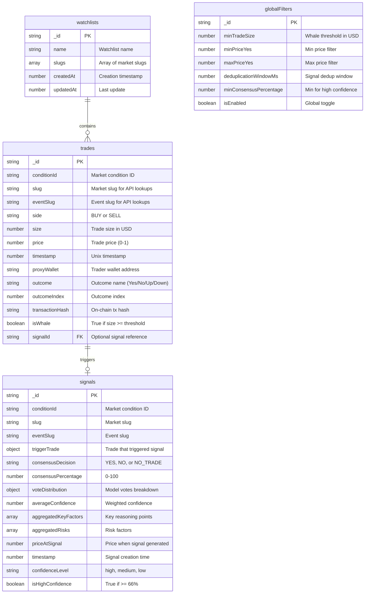

# ♻️ refactor: Polymarket Backend Refactor & API Client

## Overview

A comprehensive refactor of the Convex backend to create a reusable Polymarket API client using Effect.ts, simplify WebSocket trade collection to store only essential data, and shift from stale database storage to on-demand API fetching for market/event details.

### Key Objectives

1. **Create Polymarket API Client** - Reusable Effect.ts service with caching in Convex
2. **Simplify Trade Collection** - Store only essential trade fields (slug, eventSlug, conditionId, trade data)
3. **On-Demand Data Fetching** - Frontend fetches current market/event data via Convex actions
4. **Add User Endpoints** - Positions, trades, activity, portfolio value

## Problem Statement

### Current Issues

1. **Stale Data Storage** - WebSocket payload contains `volume24h`, `totalVolume`, `title`, `icon` that become stale immediately after storage
2. **Data Duplication** - Market metadata stored in DB duplicates what Polymarket API provides
3. **No Reusable Client** - External API calls scattered across codebase without consistent patterns
4. **Missing User Data** - No endpoints for user positions, trades, or portfolio value

### Trade Payload Analysis

Current WebSocket payload (problematic fields marked):

```typescript
payload: {
  proxyWallet: "0xe00740...", // ✅ Keep - trader identity
  side: "BUY",                // ✅ Keep - trade direction
  asset: "612954...",         // ✅ Keep - token ID
  conditionId: "0x505ce...",  // ✅ Keep - market identifier
  size: 30,                   // ✅ Keep - trade size (USD)
  price: 0.75,                // ✅ Keep - trade price
  timestamp: 1766768526,      // ✅ Keep - trade time
  title: "XRP Up or Down...", // ❌ Remove - becomes stale
  slug: "xrp-updown-15m...",  // ✅ Keep - for API lookups
  icon: "https://...",        // ❌ Remove - fetch on-demand
  eventSlug: "xrp-updown...", // ✅ Keep - for event lookups
  outcome: "Up",              // ✅ Keep - position direction
  outcomeIndex: 0,            // ✅ Keep - outcome identifier
  name: "distinct-baguette",  // ⚠️ Optional - trader name
  pseudonym: "Frozen-Tech..", // ⚠️ Optional - trader pseudonym
  transactionHash: "0xa20..", // ✅ Keep - for verification
}
```

## Proposed Solution

### Architecture Overview

```
┌─────────────────────────────────────────────────────────────────────────┐
│                           Frontend (React)                               │
│                    Convex React Hooks + Real-time Queries               │
└───────────────────────────────────┬─────────────────────────────────────┘
                                    │
                                    ▼
┌─────────────────────────────────────────────────────────────────────────┐
│                         Convex Backend                                   │
│  ┌─────────────────────────────────────────────────────────────────┐   │
│  │              Polymarket Client (Effect.ts Service)               │   │
│  │  ┌─────────────┐  ┌─────────────┐  ┌─────────────────────────┐  │   │
│  │  │   events/   │  │  markets/   │  │        users/           │  │   │
│  │  │ getBySlug   │  │ getBySlug   │  │ positions, trades,      │  │   │
│  │  │ getById     │  │ getById     │  │ activity, portfolioValue│  │   │
│  │  │ list        │  │ list        │  │ closedPositions, leader │  │   │
│  │  └─────────────┘  └─────────────┘  └─────────────────────────┘  │   │
│  │                           │                                      │   │
│  │                    ┌──────┴──────┐                               │   │
│  │                    │ CacheService│                               │   │
│  │                    │ TTL-based   │                               │   │
│  │                    └─────────────┘                               │   │
│  └─────────────────────────────────────────────────────────────────┘   │
│                                   │                                      │
│  ┌─────────────────────────────────────────────────────────────────┐   │
│  │                     Database Tables                              │   │
│  │  trades (whale trades) │ signals │ apiCache │ watchlists        │   │
│  └─────────────────────────────────────────────────────────────────┘   │
└─────────────────────────────────────────────────────────────────────────┘
                                    │
                                    ▼
┌─────────────────────────────────────────────────────────────────────────┐
│                      Lofn Data Collector (apps/lofn)                     │
│  ┌─────────────────┐  ┌─────────────────┐  ┌─────────────────┐         │
│  │ WebSocket Feed  │──│ Whale Filter    │──│ Convex Mutations│         │
│  │ orders_matched  │  │ $MIN_TRADE_SIZE │  │ upsertTrade     │         │
│  └─────────────────┘  └─────────────────┘  └─────────────────┘         │
└─────────────────────────────────────────────────────────────────────────┘
                                    │
                                    ▼
┌─────────────────────────────────────────────────────────────────────────┐
│                        Polymarket APIs                                   │
│  Gamma API (events/markets)    │    Data API (users/trades)            │
│  https://gamma-api.polymarket.com   https://data-api.polymarket.com    │
└─────────────────────────────────────────────────────────────────────────┘
```

### New Database Schema



## Technical Approach

### Phase 1: Polymarket API Client Foundation

Create `packages/backend/convex/polymarket/` directory structure:

```
packages/backend/convex/polymarket/
├── index.ts              # Re-exports all public functions
├── client.ts             # Effect.ts HTTP client service
├── schemas.ts            # Zod/Effect schemas for API responses
├── cache.ts              # Cache service implementation
├── events.ts             # Event-related Convex actions
├── markets.ts            # Market-related Convex actions
└── users.ts              # User-related Convex actions
```

#### client.ts - Effect.ts Service

```typescript
// packages/backend/convex/polymarket/client.ts
import { Context, Effect, Layer, Schedule, Duration, Data } from "effect";
import { FetchHttpClient, HttpClient, HttpClientResponse } from "@effect/platform";
import { EventSchema, MarketSchema, UserPositionsSchema } from "./schemas";

// Base URLs
const GAMMA_API = "https://gamma-api.polymarket.com";
const DATA_API = "https://data-api.polymarket.com";

// Custom error type
class PolymarketApiError extends Data.TaggedError("PolymarketApiError")<{
  message: string;
  statusCode?: number;
  endpoint: string;
}> {}

// Retry schedule: exponential backoff with 3 retries
const retrySchedule = Schedule.exponential(Duration.seconds(1)).pipe(
  Schedule.intersect(Schedule.recurs(3))
);

// Service interface
export interface PolymarketClientService {
  // Events
  readonly getEventBySlug: (slug: string) => Effect.Effect<Event, PolymarketApiError>;
  readonly getEventById: (id: string) => Effect.Effect<Event, PolymarketApiError>;
  readonly listEvents: (params: ListEventsParams) => Effect.Effect<Event[], PolymarketApiError>;

  // Markets
  readonly getMarketBySlug: (slug: string) => Effect.Effect<Market, PolymarketApiError>;
  readonly getMarketById: (id: string) => Effect.Effect<Market, PolymarketApiError>;
  readonly listMarkets: (params: ListMarketsParams) => Effect.Effect<Market[], PolymarketApiError>;

  // Users
  readonly getUserPositions: (user: string, params?: PositionsParams) => Effect.Effect<Position[], PolymarketApiError>;
  readonly getUserTrades: (user: string, params?: TradesParams) => Effect.Effect<Trade[], PolymarketApiError>;
  readonly getUserActivity: (user: string, params?: ActivityParams) => Effect.Effect<Activity[], PolymarketApiError>;
  readonly getPortfolioValue: (user: string) => Effect.Effect<PortfolioValue, PolymarketApiError>;
  readonly getClosedPositions: (user: string, params?: ClosedPositionsParams) => Effect.Effect<ClosedPosition[], PolymarketApiError>;
  readonly getLeaderboard: (params?: LeaderboardParams) => Effect.Effect<LeaderboardEntry[], PolymarketApiError>;
}

export class PolymarketClient extends Context.Tag("PolymarketClient")<
  PolymarketClient,
  PolymarketClientService
>() {}

// Implementation
const make = Effect.gen(function* () {
  const httpClient = yield* HttpClient.HttpClient;

  // Helper for GET requests with schema validation
  const get = <T>(baseUrl: string, path: string, schema: Schema.Schema<T>) =>
    Effect.gen(function* () {
      const response = yield* httpClient.get(`${baseUrl}${path}`);
      return yield* HttpClientResponse.schemaBodyJson(schema)(response);
    }).pipe(
      Effect.mapError((e) => new PolymarketApiError({
        message: String(e),
        endpoint: path,
      })),
      Effect.retry(retrySchedule)
    );

  // Events
  const getEventBySlug = (slug: string) =>
    get(GAMMA_API, `/events/slug/${encodeURIComponent(slug)}`, EventSchema);

  const getEventById = (id: string) =>
    get(GAMMA_API, `/events/${encodeURIComponent(id)}`, EventSchema);

  const listEvents = (params: ListEventsParams) => {
    const query = new URLSearchParams();
    query.set("limit", String(params.limit ?? 50));
    query.set("offset", String(params.offset ?? 0));
    if (params.active !== undefined) query.set("active", String(params.active));
    if (params.closed !== undefined) query.set("closed", String(params.closed));
    if (params.order) query.set("order", params.order);
    if (params.ascending !== undefined) query.set("ascending", String(params.ascending));
    return get(GAMMA_API, `/events?${query}`, Schema.Array(EventSchema));
  };

  // Markets
  const getMarketBySlug = (slug: string) =>
    get(GAMMA_API, `/markets/slug/${encodeURIComponent(slug)}`, MarketSchema);

  const getMarketById = (id: string) =>
    get(GAMMA_API, `/markets/${encodeURIComponent(id)}`, MarketSchema);

  const listMarkets = (params: ListMarketsParams) => {
    const query = new URLSearchParams();
    query.set("limit", String(params.limit ?? 50));
    query.set("offset", String(params.offset ?? 0));
    if (params.active !== undefined) query.set("active", String(params.active));
    if (params.closed !== undefined) query.set("closed", String(params.closed));
    return get(GAMMA_API, `/markets?${query}`, Schema.Array(MarketSchema));
  };

  // Users (Data API)
  const getUserPositions = (user: string, params?: PositionsParams) => {
    const query = new URLSearchParams({ user });
    if (params?.limit) query.set("limit", String(params.limit));
    if (params?.offset) query.set("offset", String(params.offset));
    if (params?.sizeThreshold) query.set("sizeThreshold", String(params.sizeThreshold));
    return get(DATA_API, `/positions?${query}`, Schema.Array(PositionSchema));
  };

  const getUserTrades = (user: string, params?: TradesParams) => {
    const query = new URLSearchParams({ user });
    if (params?.limit) query.set("limit", String(params.limit));
    if (params?.offset) query.set("offset", String(params.offset));
    return get(DATA_API, `/trades?${query}`, Schema.Array(TradeSchema));
  };

  const getUserActivity = (user: string, params?: ActivityParams) => {
    const query = new URLSearchParams({ user });
    if (params?.limit) query.set("limit", String(params.limit));
    if (params?.type) query.set("type", params.type);
    return get(DATA_API, `/activity?${query}`, Schema.Array(ActivitySchema));
  };

  const getPortfolioValue = (user: string) =>
    get(DATA_API, `/value?user=${encodeURIComponent(user)}`, Schema.Array(PortfolioValueSchema)).pipe(
      Effect.map((arr) => arr[0]) // API returns array with single item
    );

  const getClosedPositions = (user: string, params?: ClosedPositionsParams) => {
    const query = new URLSearchParams({ user });
    if (params?.limit) query.set("limit", String(params.limit));
    return get(DATA_API, `/closed-positions?${query}`, Schema.Array(ClosedPositionSchema));
  };

  const getLeaderboard = (params?: LeaderboardParams) => {
    const query = new URLSearchParams();
    if (params?.category) query.set("category", params.category);
    if (params?.timePeriod) query.set("timePeriod", params.timePeriod);
    if (params?.limit) query.set("limit", String(params.limit));
    return get(DATA_API, `/v1/leaderboard?${query}`, Schema.Array(LeaderboardSchema));
  };

  return {
    getEventBySlug,
    getEventById,
    listEvents,
    getMarketBySlug,
    getMarketById,
    listMarkets,
    getUserPositions,
    getUserTrades,
    getUserActivity,
    getPortfolioValue,
    getClosedPositions,
    getLeaderboard,
  };
});

export const PolymarketClientLive = Layer.effect(PolymarketClient, make).pipe(
  Layer.provide(FetchHttpClient.layer)
);
```

#### schemas.ts - API Response Schemas

```typescript
// packages/backend/convex/polymarket/schemas.ts
import { Schema } from "effect";

// Market schema matching Polymarket Gamma API
export const MarketSchema = Schema.Struct({
  id: Schema.String,
  question: Schema.optional(Schema.String),
  conditionId: Schema.String,
  slug: Schema.optional(Schema.String),
  description: Schema.optional(Schema.String),
  outcomes: Schema.optional(Schema.String), // JSON string array
  outcomePrices: Schema.optional(Schema.String), // JSON string array
  volume: Schema.optional(Schema.String),
  volume24hr: Schema.optional(Schema.Number),
  liquidity: Schema.optional(Schema.String),
  active: Schema.optional(Schema.Boolean),
  closed: Schema.optional(Schema.Boolean),
  bestBid: Schema.optional(Schema.Number),
  bestAsk: Schema.optional(Schema.Number),
  lastTradePrice: Schema.optional(Schema.Number),
  startDate: Schema.optional(Schema.String),
  endDate: Schema.optional(Schema.String),
});

export type Market = Schema.Schema.Type<typeof MarketSchema>;

// Event schema matching Polymarket Gamma API
export const EventSchema = Schema.Struct({
  id: Schema.String,
  slug: Schema.optional(Schema.String),
  title: Schema.optional(Schema.String),
  description: Schema.optional(Schema.String),
  image: Schema.optional(Schema.String),
  icon: Schema.optional(Schema.String),
  active: Schema.optional(Schema.Boolean),
  closed: Schema.optional(Schema.Boolean),
  volume: Schema.optional(Schema.Number),
  volume24hr: Schema.optional(Schema.Number),
  liquidity: Schema.optional(Schema.Number),
  markets: Schema.optional(Schema.Array(MarketSchema)),
  startDate: Schema.optional(Schema.String),
  endDate: Schema.optional(Schema.String),
});

export type Event = Schema.Schema.Type<typeof EventSchema>;

// User position schema (Data API)
export const PositionSchema = Schema.Struct({
  proxyWallet: Schema.String,
  asset: Schema.String,
  conditionId: Schema.String,
  size: Schema.Number,
  avgPrice: Schema.Number,
  initialValue: Schema.Number,
  currentValue: Schema.Number,
  cashPnl: Schema.Number,
  percentPnl: Schema.Number,
  curPrice: Schema.Number,
  redeemable: Schema.Boolean,
  mergeable: Schema.Boolean,
  title: Schema.String,
  slug: Schema.String,
  eventSlug: Schema.String,
  outcome: Schema.String,
  outcomeIndex: Schema.Number,
});

export type Position = Schema.Schema.Type<typeof PositionSchema>;

// User trade schema (Data API)
export const UserTradeSchema = Schema.Struct({
  proxyWallet: Schema.String,
  side: Schema.String,
  asset: Schema.String,
  conditionId: Schema.String,
  size: Schema.Number,
  price: Schema.Number,
  timestamp: Schema.Number,
  title: Schema.String,
  slug: Schema.String,
  eventSlug: Schema.String,
  outcome: Schema.String,
  outcomeIndex: Schema.Number,
  transactionHash: Schema.String,
});

// Activity schema (Data API)
export const ActivitySchema = Schema.Struct({
  proxyWallet: Schema.String,
  timestamp: Schema.Number,
  conditionId: Schema.String,
  type: Schema.String, // TRADE, SPLIT, MERGE, REDEEM, REWARD, CONVERSION
  size: Schema.Number,
  usdcSize: Schema.Number,
  transactionHash: Schema.String,
  price: Schema.optional(Schema.Number),
  side: Schema.optional(Schema.String),
  title: Schema.String,
  slug: Schema.String,
  eventSlug: Schema.String,
  outcome: Schema.String,
});

// Portfolio value schema
export const PortfolioValueSchema = Schema.Struct({
  user: Schema.String,
  value: Schema.Number,
});

// Closed position schema
export const ClosedPositionSchema = Schema.Struct({
  proxyWallet: Schema.String,
  asset: Schema.String,
  conditionId: Schema.String,
  avgPrice: Schema.Number,
  totalBought: Schema.Number,
  realizedPnl: Schema.Number,
  curPrice: Schema.Number,
  timestamp: Schema.Number,
  title: Schema.String,
  slug: Schema.String,
  eventSlug: Schema.String,
  outcome: Schema.String,
  outcomeIndex: Schema.Number,
});

// Leaderboard entry schema
export const LeaderboardSchema = Schema.Struct({
  rank: Schema.String,
  proxyWallet: Schema.String,
  userName: Schema.optional(Schema.String),
  vol: Schema.Number,
  pnl: Schema.Number,
  profileImage: Schema.optional(Schema.String),
  verifiedBadge: Schema.optional(Schema.Boolean),
});
```

#### cache.ts - Using @convex-dev/action-cache Component

**Note:** Instead of a custom cache table, we use the official `@convex-dev/action-cache` component which:
- Handles TTL-based expiration automatically
- Provides daily cron cleanup of expired entries
- Manages cache keys based on action name + arguments
- Is the recommended pattern for caching external API responses

**Installation:**

```bash
bun add @convex-dev/action-cache
```

**Setup in `convex/convex.config.ts`:**

```typescript
import { defineApp } from "convex/server";
import cache from "@convex-dev/action-cache/convex.config.js";

const app = defineApp();
app.use(cache);
export default app;
```

**Cache configuration in `packages/backend/convex/polymarket/cache.ts`:**

```typescript
// packages/backend/convex/polymarket/cache.ts
import { ActionCache } from "@convex-dev/action-cache";
import { components } from "../_generated/api";
import { internal } from "../_generated/api";

// TTL values in milliseconds
export const CACHE_TTL = {
  event: 60 * 60 * 1000,      // 1 hour - events are mostly static
  market: 5 * 60 * 1000,      // 5 minutes - prices change frequently
  positions: 2 * 60 * 1000,   // 2 minutes - positions change on trades
  trades: 30 * 60 * 1000,     // 30 minutes - historical
  activity: 5 * 60 * 1000,    // 5 minutes
  leaderboard: 15 * 60 * 1000, // 15 minutes
} as const;

// Cache instances for each resource type
export const eventBySlugCache = new ActionCache(components.actionCache, {
  action: internal.polymarket.events.fetchEventBySlug,
  name: "polymarket-event-by-slug-v1",
  ttl: CACHE_TTL.event,
});

export const eventByIdCache = new ActionCache(components.actionCache, {
  action: internal.polymarket.events.fetchEventById,
  name: "polymarket-event-by-id-v1",
  ttl: CACHE_TTL.event,
});

export const marketBySlugCache = new ActionCache(components.actionCache, {
  action: internal.polymarket.markets.fetchMarketBySlug,
  name: "polymarket-market-by-slug-v1",
  ttl: CACHE_TTL.market,
});

export const marketByIdCache = new ActionCache(components.actionCache, {
  action: internal.polymarket.markets.fetchMarketById,
  name: "polymarket-market-by-id-v1",
  ttl: CACHE_TTL.market,
});

export const userPositionsCache = new ActionCache(components.actionCache, {
  action: internal.polymarket.users.fetchUserPositions,
  name: "polymarket-positions-v1",
  ttl: CACHE_TTL.positions,
});

export const leaderboardCache = new ActionCache(components.actionCache, {
  action: internal.polymarket.users.fetchLeaderboard,
  name: "polymarket-leaderboard-v1",
  ttl: CACHE_TTL.leaderboard,
});
```

**Benefits over custom implementation:**
- No custom `apiCache` table needed
- Automatic cleanup via daily cron (no manual cleanup mutations)
- Version management via cache name (change name to invalidate all old entries)
- `cache.remove()` and `cache.removeAllForName()` for manual invalidation

#### events.ts - Event Actions (Using ActionCache)

```typescript
// packages/backend/convex/polymarket/events.ts
import { action, internalAction } from "../_generated/server";
import { v } from "convex/values";
import { Effect } from "effect";
import { PolymarketClient, PolymarketClientLive } from "./client";
import { eventBySlugCache, eventByIdCache } from "./cache";

// Internal action - does the actual API call (used by cache)
export const fetchEventBySlug = internalAction({
  args: { slug: v.string() },
  returns: v.any(),
  handler: async (ctx, args) => {
    const program = Effect.gen(function* () {
      const client = yield* PolymarketClient;
      return yield* client.getEventBySlug(args.slug);
    }).pipe(Effect.provide(PolymarketClientLive));

    return Effect.runPromise(program);
  },
});

export const fetchEventById = internalAction({
  args: { id: v.string() },
  returns: v.any(),
  handler: async (ctx, args) => {
    const program = Effect.gen(function* () {
      const client = yield* PolymarketClient;
      return yield* client.getEventById(args.id);
    }).pipe(Effect.provide(PolymarketClientLive));

    return Effect.runPromise(program);
  },
});

// Public actions - use cache wrapper
export const getEventBySlug = action({
  args: { slug: v.string() },
  returns: v.any(),
  handler: async (ctx, args) => {
    // ActionCache handles caching + TTL automatically
    return eventBySlugCache.fetch(ctx, { slug: args.slug });
  },
});

export const getEventById = action({
  args: { id: v.string() },
  returns: v.any(),
  handler: async (ctx, args) => {
    return eventByIdCache.fetch(ctx, { id: args.id });
  },
});

export const listEvents = action({
  args: {
    limit: v.optional(v.number()),
    offset: v.optional(v.number()),
    active: v.optional(v.boolean()),
    closed: v.optional(v.boolean()),
    order: v.optional(v.string()),
    ascending: v.optional(v.boolean()),
  },
  returns: v.any(),
  handler: async (ctx, args) => {
    // List queries are not cached (always fresh for browsing)
    const program = Effect.gen(function* () {
      const client = yield* PolymarketClient;
      return yield* client.listEvents(args);
    }).pipe(Effect.provide(PolymarketClientLive));

    return Effect.runPromise(program);
  },
});
```

#### markets.ts - Market Actions (Using ActionCache)

```typescript
// packages/backend/convex/polymarket/markets.ts
import { action, internalAction } from "../_generated/server";
import { v } from "convex/values";
import { Effect } from "effect";
import { PolymarketClient, PolymarketClientLive } from "./client";
import { marketBySlugCache, marketByIdCache } from "./cache";

// Internal actions - do the actual API calls (used by cache)
export const fetchMarketBySlug = internalAction({
  args: { slug: v.string() },
  returns: v.any(),
  handler: async (ctx, args) => {
    const program = Effect.gen(function* () {
      const client = yield* PolymarketClient;
      return yield* client.getMarketBySlug(args.slug);
    }).pipe(Effect.provide(PolymarketClientLive));

    return Effect.runPromise(program);
  },
});

export const fetchMarketById = internalAction({
  args: { id: v.string() },
  returns: v.any(),
  handler: async (ctx, args) => {
    const program = Effect.gen(function* () {
      const client = yield* PolymarketClient;
      return yield* client.getMarketById(args.id);
    }).pipe(Effect.provide(PolymarketClientLive));

    return Effect.runPromise(program);
  },
});

// Public actions - use cache wrapper
export const getMarketBySlug = action({
  args: { slug: v.string() },
  returns: v.any(),
  handler: async (ctx, args) => {
    return marketBySlugCache.fetch(ctx, { slug: args.slug });
  },
});

export const getMarketById = action({
  args: { id: v.string() },
  returns: v.any(),
  handler: async (ctx, args) => {
    return marketByIdCache.fetch(ctx, { id: args.id });
  },
});

export const listMarkets = action({
  args: {
    limit: v.optional(v.number()),
    offset: v.optional(v.number()),
    active: v.optional(v.boolean()),
    closed: v.optional(v.boolean()),
  },
  returns: v.any(),
  handler: async (ctx, args) => {
    // List queries not cached (fresh for browsing)
    const program = Effect.gen(function* () {
      const client = yield* PolymarketClient;
      return yield* client.listMarkets(args);
    }).pipe(Effect.provide(PolymarketClientLive));

    return Effect.runPromise(program);
  },
});
```

#### users.ts - User Data Actions

```typescript
// packages/backend/convex/polymarket/users.ts
import { action } from "../_generated/server";
import { internal } from "../_generated/api";
import { v } from "convex/values";
import { Effect } from "effect";
import { PolymarketClient, PolymarketClientLive } from "./client";
import { CACHE_TTL } from "./cache";

// Validate Ethereum address format
const isValidAddress = (address: string) =>
  /^0x[a-fA-F0-9]{40}$/.test(address);

export const getUserPositions = action({
  args: {
    user: v.string(),
    limit: v.optional(v.number()),
    offset: v.optional(v.number()),
    sizeThreshold: v.optional(v.number()),
  },
  returns: v.any(),
  handler: async (ctx, args) => {
    if (!isValidAddress(args.user)) {
      throw new Error(`Invalid Ethereum address: ${args.user}`);
    }

    const cacheKey = `positions:${args.user}:${args.limit ?? 100}:${args.offset ?? 0}`;

    const cached = await ctx.runQuery(internal.polymarket.cache.getCached, { cacheKey });
    if (cached) {
      return JSON.parse(cached);
    }

    const program = Effect.gen(function* () {
      const client = yield* PolymarketClient;
      return yield* client.getUserPositions(args.user, {
        limit: args.limit,
        offset: args.offset,
        sizeThreshold: args.sizeThreshold,
      });
    }).pipe(Effect.provide(PolymarketClientLive));

    const result = await Effect.runPromise(program);

    await ctx.runMutation(internal.polymarket.cache.setCache, {
      cacheKey,
      resourceType: "positions",
      data: JSON.stringify(result),
      ttlMs: CACHE_TTL.positions,
    });

    return result;
  },
});

export const getUserTrades = action({
  args: {
    user: v.string(),
    limit: v.optional(v.number()),
    offset: v.optional(v.number()),
  },
  returns: v.any(),
  handler: async (ctx, args) => {
    if (!isValidAddress(args.user)) {
      throw new Error(`Invalid Ethereum address: ${args.user}`);
    }

    const cacheKey = `trades:${args.user}:${args.limit ?? 100}:${args.offset ?? 0}`;

    const cached = await ctx.runQuery(internal.polymarket.cache.getCached, { cacheKey });
    if (cached) {
      return JSON.parse(cached);
    }

    const program = Effect.gen(function* () {
      const client = yield* PolymarketClient;
      return yield* client.getUserTrades(args.user, { limit: args.limit, offset: args.offset });
    }).pipe(Effect.provide(PolymarketClientLive));

    const result = await Effect.runPromise(program);

    await ctx.runMutation(internal.polymarket.cache.setCache, {
      cacheKey,
      resourceType: "trades",
      data: JSON.stringify(result),
      ttlMs: CACHE_TTL.trades,
    });

    return result;
  },
});

export const getUserActivity = action({
  args: {
    user: v.string(),
    limit: v.optional(v.number()),
    type: v.optional(v.string()), // TRADE, SPLIT, MERGE, REDEEM, REWARD, CONVERSION
  },
  returns: v.any(),
  handler: async (ctx, args) => {
    if (!isValidAddress(args.user)) {
      throw new Error(`Invalid Ethereum address: ${args.user}`);
    }

    const program = Effect.gen(function* () {
      const client = yield* PolymarketClient;
      return yield* client.getUserActivity(args.user, { limit: args.limit, type: args.type });
    }).pipe(Effect.provide(PolymarketClientLive));

    return Effect.runPromise(program);
  },
});

export const getPortfolioValue = action({
  args: { user: v.string() },
  returns: v.any(),
  handler: async (ctx, args) => {
    if (!isValidAddress(args.user)) {
      throw new Error(`Invalid Ethereum address: ${args.user}`);
    }

    const program = Effect.gen(function* () {
      const client = yield* PolymarketClient;
      return yield* client.getPortfolioValue(args.user);
    }).pipe(Effect.provide(PolymarketClientLive));

    return Effect.runPromise(program);
  },
});

export const getClosedPositions = action({
  args: {
    user: v.string(),
    limit: v.optional(v.number()),
    offset: v.optional(v.number()),
  },
  returns: v.any(),
  handler: async (ctx, args) => {
    if (!isValidAddress(args.user)) {
      throw new Error(`Invalid Ethereum address: ${args.user}`);
    }

    const program = Effect.gen(function* () {
      const client = yield* PolymarketClient;
      return yield* client.getClosedPositions(args.user, { limit: args.limit });
    }).pipe(Effect.provide(PolymarketClientLive));

    return Effect.runPromise(program);
  },
});

export const getLeaderboard = action({
  args: {
    category: v.optional(v.string()), // OVERALL, POLITICS, SPORTS, CRYPTO, etc.
    timePeriod: v.optional(v.string()), // DAY, WEEK, MONTH, ALL
    orderBy: v.optional(v.string()), // PNL, VOL
    limit: v.optional(v.number()),
  },
  returns: v.any(),
  handler: async (ctx, args) => {
    const cacheKey = `leaderboard:${args.category ?? 'OVERALL'}:${args.timePeriod ?? 'DAY'}`;

    const cached = await ctx.runQuery(internal.polymarket.cache.getCached, { cacheKey });
    if (cached) {
      return JSON.parse(cached);
    }

    const program = Effect.gen(function* () {
      const client = yield* PolymarketClient;
      return yield* client.getLeaderboard(args);
    }).pipe(Effect.provide(PolymarketClientLive));

    const result = await Effect.runPromise(program);

    await ctx.runMutation(internal.polymarket.cache.setCache, {
      cacheKey,
      resourceType: "leaderboard",
      data: JSON.stringify(result),
      ttlMs: CACHE_TTL.leaderboard,
    });

    return result;
  },
});
```

### Phase 2: Schema Migration

#### New Schema Definition

```typescript
// packages/backend/convex/schema.ts (updates)
import { defineSchema, defineTable } from "convex/server";
import { v } from "convex/values";

export default defineSchema({
  // NEW: Simplified trades table (replaces markets for storage)
  trades: defineTable({
    // Identifiers (for API lookups)
    conditionId: v.string(),
    slug: v.string(),
    eventSlug: v.string(),

    // Trade data
    side: v.string(), // "BUY" | "SELL"
    size: v.number(), // USD amount
    price: v.number(), // 0-1
    timestamp: v.number(), // Unix ms

    // Trader info
    proxyWallet: v.string(),

    // Outcome info
    outcome: v.string(),
    outcomeIndex: v.number(),

    // Verification
    transactionHash: v.optional(v.string()),

    // Whale flag
    isWhale: v.boolean(),

    // Signal reference (if triggered analysis)
    signalId: v.optional(v.id("signals")),
  })
    .index("by_condition_id", ["conditionId"])
    .index("by_slug", ["slug"])
    .index("by_event_slug", ["eventSlug"])
    .index("by_timestamp", ["timestamp"])
    .index("by_whale", ["isWhale", "timestamp"])
    .index("by_wallet", ["proxyWallet", "timestamp"])
    .index("by_dedup", ["conditionId", "timestamp", "size", "price", "side"]),

  // NOTE: API caching handled by @convex-dev/action-cache component
  // No custom cache table needed - component manages its own storage

  // KEEP: Signals table (updated trigger trade structure)
  signals: defineTable({
    // Market identifiers (for API lookups)
    conditionId: v.string(),
    slug: v.string(),
    eventSlug: v.string(),

    // Trigger trade (simplified)
    triggerTrade: v.object({
      size: v.number(),
      price: v.number(),
      side: v.string(),
      proxyWallet: v.optional(v.string()),
      timestamp: v.number(),
    }),

    // Consensus results
    consensusDecision: v.string(), // "YES" | "NO" | "NO_TRADE"
    consensusPercentage: v.number(),
    voteDistribution: v.object({
      YES: v.number(),
      NO: v.number(),
      NO_TRADE: v.number(),
    }),
    averageConfidence: v.number(),
    aggregatedKeyFactors: v.array(v.string()),
    aggregatedRisks: v.array(v.string()),

    // Price context
    priceAtSignal: v.number(),

    // Metadata
    timestamp: v.number(),
    confidenceLevel: v.string(), // "high" | "medium" | "low"
    isHighConfidence: v.boolean(),
  })
    .index("by_slug", ["slug"])
    .index("by_condition_id", ["conditionId"])
    .index("by_timestamp", ["timestamp"])
    .index("by_decision", ["consensusDecision", "timestamp"])
    .index("by_high_confidence", ["isHighConfidence", "timestamp"]),

  // KEEP: Global filters (unchanged)
  globalFilters: defineTable({
    minTradeSize: v.number(),
    minPriceYes: v.number(),
    maxPriceYes: v.number(),
    deduplicationWindowMs: v.number(),
    minConsensusPercentage: v.number(),
    isEnabled: v.boolean(),
  }),

  // KEEP: Watchlists (updated to use slugs)
  watchlists: defineTable({
    name: v.string(),
    slugs: v.array(v.string()), // Market slugs
    createdAt: v.number(),
    updatedAt: v.number(),
  }).index("by_name", ["name"]),
});
```

### Phase 3: WebSocket Collection Refactor

#### Updated WebSocketService

```typescript
// apps/lofn/src/services/polymarket/WebSocketService.ts (updates)

// Simplified trade payload schema - only essential fields
export const TradePayloadSchema = Schema.Struct({
  // Required identifiers
  conditionId: Schema.String,
  slug: Schema.String,
  eventSlug: Schema.String,

  // Required trade data
  side: Schema.String,
  size: Schema.Number,
  price: Schema.Number,
  timestamp: Schema.Number,

  // Required outcome
  outcome: Schema.String,
  outcomeIndex: Schema.Number,

  // Optional fields
  proxyWallet: Schema.optional(Schema.String),
  transactionHash: Schema.optional(Schema.String),
});

// Process trade and store only essential data
const processTradeMessage = (trade: TradePayload): Effect.Effect<void, Error, ConvexDataService> =>
  Effect.gen(function* () {
    const convex = yield* ConvexDataService;
    const filters = yield* getFilters();

    // Apply filters
    if (!shouldIncludeTrade(trade, filters)) {
      return; // Skip non-matching trades
    }

    // Determine if whale trade
    const isWhale = trade.size >= filters.minTradeSize;

    // Check for duplicate
    const isDuplicate = yield* convex.checkTradeDuplicate({
      conditionId: trade.conditionId,
      timestamp: trade.timestamp,
      size: trade.size,
      price: trade.price,
      side: trade.side,
    });

    if (isDuplicate) {
      console.log(`Duplicate trade detected, skipping: ${trade.conditionId}`);
      return;
    }

    // Store minimal trade data
    const tradeId = yield* convex.insertTrade({
      conditionId: trade.conditionId,
      slug: trade.slug,
      eventSlug: trade.eventSlug,
      side: trade.side,
      size: trade.size,
      price: trade.price,
      timestamp: trade.timestamp,
      proxyWallet: trade.proxyWallet,
      outcome: trade.outcome,
      outcomeIndex: trade.outcomeIndex,
      transactionHash: trade.transactionHash,
      isWhale,
    });

    // Trigger signal analysis for whale trades
    if (isWhale && filters.isEnabled) {
      yield* convex.scheduleSignalAnalysis({
        tradeId,
        conditionId: trade.conditionId,
        slug: trade.slug,
        eventSlug: trade.eventSlug,
        tradeContext: {
          size: trade.size,
          price: trade.price,
          side: trade.side,
          proxyWallet: trade.proxyWallet,
          timestamp: trade.timestamp,
        },
      });
    }
  });
```

## Acceptance Criteria

### Functional Requirements

- [ ] Polymarket API client fetches events by slug and ID correctly
- [ ] Polymarket API client fetches markets by slug and ID correctly
- [ ] Polymarket API client fetches user positions, trades, activity, portfolio value
- [ ] Cache stores API responses with appropriate TTL per resource type
- [ ] Cache returns cached data when not expired
- [ ] Cache cleanup removes expired entries
- [ ] WebSocket collector stores only essential trade fields
- [ ] Whale trades trigger signal analysis
- [ ] Trade deduplication prevents duplicate records
- [ ] Frontend can fetch current market data via Convex actions

### Non-Functional Requirements

- [ ] API client retries failed requests with exponential backoff
- [ ] API responses validated against Effect schemas
- [ ] Convex actions have explicit return type validators
- [ ] Cache TTLs are configurable per resource type
- [ ] Error responses include meaningful messages

### Quality Gates

- [ ] All Convex functions pass type checking (`bun run typecheck`)
- [ ] No runtime errors in development mode
- [ ] Cache hit rate > 50% for repeated requests
- [ ] API response time < 5s for cached requests
- [ ] API response time < 15s for non-cached requests

## Success Metrics

1. **Data Freshness**: Frontend displays prices no older than 5 minutes
2. **Storage Efficiency**: Trade records reduced by ~60% (removing stale fields)
3. **API Usage**: Polymarket API calls reduced by 50%+ via caching
4. **Signal Latency**: Whale signals generated within 30 seconds of trade

## Dependencies & Prerequisites

1. **Effect.ts packages**: `effect`, `@effect/platform`, `@effect/schema`
2. **Convex components**: `@convex-dev/action-cache` (required for caching external API responses)
3. **Polymarket API**: Gamma API and Data API remain available and stable

### Installation

```bash
# From packages/backend
bun add @convex-dev/action-cache
```

## Risk Analysis & Mitigation

| Risk | Impact | Likelihood | Mitigation |
|------|--------|------------|------------|
| Polymarket API rate limits | High | Medium | Implement caching with appropriate TTLs, add rate limiting |
| Schema migration data loss | High | Low | Run migration during low-traffic, backup data first |
| WebSocket disconnections | Medium | Medium | Implement reconnection with backfill from historical API |
| Cache invalidation issues | Medium | Low | Use short TTLs, add manual cache invalidation action |
| Effect.ts learning curve | Low | Medium | Start with simple actions, iterate on patterns |

## Future Considerations

1. **Package Extraction**: Extract Polymarket client to `packages/polymarket-client` for reuse
2. **Real-time Subscriptions**: Use Convex subscriptions for live price updates
3. **Rate Limiter Component**: Add `@convex-dev/rate-limiter` for API quota management
4. **Circuit Breaker**: Implement fallback when Polymarket API is unavailable

## References

### Internal References
- Current schema: `packages/backend/convex/schema.ts`
- WebSocket service: `apps/lofn/src/services/polymarket/WebSocketService.ts`
- ConvexDataService: `apps/lofn/src/services/data/ConvexDataService.ts`
- Analysis flow: `packages/backend/convex/analysis.ts`

### External References
- [Convex Actions Tutorial](https://docs.convex.dev/tutorial/actions)
- [Convex Action Cache](https://www.convex.dev/components/action-cache)
- [Effect.ts HttpClient](https://effect-ts.github.io/effect/platform/HttpClient.ts.html)
- [Polymarket Gamma API](https://docs.polymarket.com/developers/gamma-markets-api)
- [Polymarket Data API](https://docs.polymarket.com/api-reference/core)

### Related Work
- Polymarket official TypeScript client: [clob-client](https://github.com/Polymarket/clob-client)
- Community kit: [polymarket-kit](https://github.com/HuakunShen/polymarket-kit)

---

*Plan created: 2025-12-26*

*Generated with Claude Code*
